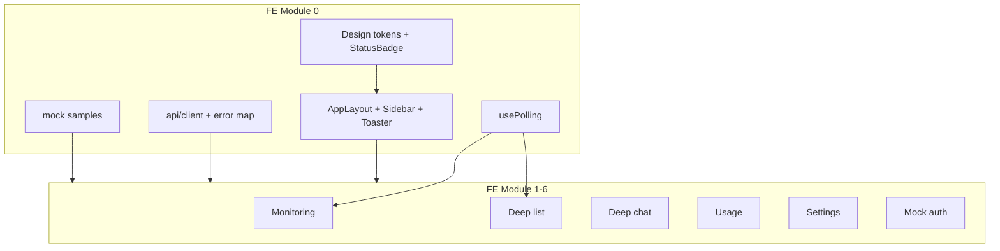

# FE Module 0 — Index (инфраструктура SPA)

Индексный план реализации **monitor_frontend** для R2. Source of truth контракта — [module-17-web-frontend-contract.plan.md](../R2/module-17-web-frontend-contract.plan.md) (M17). Per-page планы: `module-1` … `module-6` в этой же папке.

---

## Цель

Зафиксировать общую инфраструктуру SPA — дизайн-токены, layout, badge-систему, HTTP-клиент, polling-хуки и mock-данные — чтобы страничные модули не дублировали контракт и UX-инварианты.

---

## Границы

**Входит:**

- Дизайн-система (палитра light + dark, theme toggle, типографика, микро-UX: анимации, loading, a11y).
- `AppLayout`, `Sidebar`, провайдер toast (`sonner`).
- `StatusBadge` — единые цвета статусов на всех страницах.
- HTTP-клиент `src/api/` с env `ANOMALY_API_BASE_URL` (включая `/api`).
- Хук `usePolling` (monitoring + база для deep).
- Mock fixtures для разработки и unit-тестов.
- Выравнивание маршрутов с M17: `/settings/agents`, `deep/:auditId`.

**Не входит:**

- Реализация бизнес-страниц (module-1…6).
- Подключение реального API в prod-path (Phase 6 setup; здесь — клиент + fixtures).
- `useDeepChat` (module-3).
- Deploy, e2e Playwright (module-level + Phase 5 setup).
- Дублирование OpenAPI-полей — только ссылки на теги/пути M17 §10.y.

---

## Дизайн-система (апрув 2026-06-22)

### Концепция

- **Стиль:** light mode по умолчанию, data-dense ops dashboard, desktop-first (оператор за рабочим столом). Dark mode — опционально через toggle в layout.
- **Тема:** `:root` = light tokens; `.dark` на `<html>` = dark tokens (shadcn + Tailwind `@custom-variant dark`). Переключатель в `Sidebar` или header `AppLayout`; выбор сохраняется в `localStorage` (`monitor-theme`: `light` | `dark`). При первом визите — **light**, без учёта `prefers-color-scheme` (явный выбор оператора).
- **Визуальный референс:** [colibrix.one](https://colibrix.one) — fintech-премиальность, фиолетовый brand-accent (colibri / CTA). Light: светлые поверхности с лёгким violet undertone; dark: тёмные слои как на сайте. Без hero-анимаций и marketing glow; акцент только на интерактиве и live-статусах.
- **Contrast:** минимум 4.5:1 для текста и интерактива в **обеих** темах.
- **Библиотеки UI:** shadcn/ui + Tailwind; таблицы — `@tanstack/react-table`; toast — `sonner`; графики (module-1) — **Recharts**.
- **Иконки:** Lucide SVG 24×24; без эмодзи как иконок (`Sun` / `Moon` для theme toggle).

### Выбор primary (синий / зелёный / фиолетовый)

| Вариант | Hex | Плюсы | Минусы для ops-dashboard |
|---------|-----|-------|--------------------------|
| Синий (indigo) | `#6366F1` | Нейтральный SaaS, хороший contrast | Далек от colibrix brand |
| Зелёный | `#22C55E` | «Живой» accent | Конфликт с `success` в StatusBadge |
| **Фиолетовый (violet)** | `#8B5CF6` | Совпадает с colibrix.one; отделён от success/error | — |

**Решение:** primary violet — light `#7C3AED`, dark `#8B5CF6`; ring light `#8B5CF6`, dark `#A78BFA`. Синий indigo `#6366F1` — только как `--accent` для вторичных hover-состояний (sidebar item hover), не как primary CTA.

### Палитра (CSS-переменные / Tailwind theme)

Две полные наборы токенов: **light** (`:root`) — default, **dark** (`.dark`). Слои с лёгким indigo/violet undertone, не чистый серый. Brand-primary и status-hex общие; меняются surface/foreground/border.

#### Light (`:root`, default)

| Роль | Token | Hex | oklch |
|------|-------|-----|-------|
| Background base | `--background` | `#F8F7FC` | `oklch(0.97 0.01 285)` |
| Surface / card | `--card` | `#FFFFFF` | `oklch(1 0 0)` |
| Elevated | `--elevated` | `#F3F2F8` | `oklch(0.96 0.012 285)` |
| Border | `--border` | `#E2E0EA` | `oklch(0.90 0.02 285)` |
| Text primary | `--foreground` | `#1A1726` | `oklch(0.22 0.03 285)` |
| Text muted | `--muted-foreground` | `#6B6578` | `oklch(0.52 0.03 285)` |
| Interactive / CTA | `--primary` | `#7C3AED` | `oklch(0.55 0.24 285)` |
| Primary on CTA | `--primary-foreground` | `#FFFFFF` | `oklch(1 0 0)` |
| Secondary hover | `--accent` | `#6366F1` | `oklch(0.58 0.20 275)` |
| Focus ring | `--ring` | `#8B5CF6` | `oklch(0.62 0.22 285)` |
| CTA / warning accent | `--accent-warn` | `#D97706` | `oklch(0.65 0.17 55)` |
| Destructive | `--destructive` | `#DC2626` | `oklch(0.55 0.22 25)` |

#### Dark (`.dark`)

| Роль | Token | Hex | oklch |
|------|-------|-----|-------|
| Background base | `--background` | `#0A0A14` | `oklch(0.14 0.02 285)` |
| Surface / card | `--card` | `#14121F` | `oklch(0.18 0.025 285)` |
| Elevated | `--elevated` | `#1C1929` | `oklch(0.22 0.03 285)` |
| Border | `--border` | `#2A2540` | `oklch(0.30 0.04 285)` |
| Text primary | `--foreground` | `#ECEAF4` | `oklch(0.94 0.01 285)` |
| Text muted | `--muted-foreground` | `#9490A8` | `oklch(0.68 0.03 285)` |
| Interactive / CTA | `--primary` | `#8B5CF6` | `oklch(0.62 0.22 285)` |
| Primary on CTA | `--primary-foreground` | `#0A0A14` | `oklch(0.14 0.02 285)` |
| Secondary hover | `--accent` | `#6366F1` | `oklch(0.58 0.20 275)` |
| Focus ring | `--ring` | `#A78BFA` | `oklch(0.72 0.18 285)` |
| CTA / warning accent | `--accent-warn` | `#F59E0B` | `oklch(0.75 0.16 75)` |
| Destructive | `--destructive` | `#EF4444` | `oklch(0.58 0.22 25)` |

`--radius`: `0.5rem` (как в текущем scaffolde).

#### Theme switch (реализация)

| Элемент | Правило |
|---------|---------|
| Провайдер | `ThemeProvider` в `main.tsx` (или обёртка вокруг `RouterProvider`) |
| Persist | `localStorage.monitor-theme`; при mount — синхронизация class на `<html>` до первого paint (inline script в `index.html` или sync init в provider) |
| UI | Icon button в `Sidebar` footer: light → Moon; dark → Sun |
| Страницы | Только semantic tokens (`bg-background`, `text-foreground`); **без** hardcoded hex в компонентах |

### StatusBadge (семантические цвета, единые везде)

Единый компонент для **monitoring report** и **deep_chat_state**. Семантика не смешивается с brand-primary: `success`/`error` — зелёный/красный; `active` — violet = `--primary`. Страницы не задают ad-hoc hex для статусов.

#### Monitoring / report

| status | hex | применение |
|--------|-----|------------|
| `success` | `#22C55E` | hypothesis success, run ok |
| `error` | `#EF4444` | report error, chat error |
| `skipped` | `#94A3B8` | report skipped |
| `active` | `#7C3AED` / `#8B5CF6` | tick in progress, chat active (light / dark = `--primary`) |
| `awaiting_approval` | `#F59E0B` | pending_action (= `--accent-warn`) |
| `completed` | `#2DD4BF` | terminal chat completed (teal) |

#### Deep chat (доп. варианты того же StatusBadge)

| status | hex | применение |
|--------|-----|------------|
| `not_started` | `#94A3B8` | deep chat не открыт (= muted/skipped tone) |
| `cancelled` | `#94A3B8` | deep chat отменён |

Badge: цвет + текстовая метка (цвет не единственный индикатор).

#### Операционные индикаторы (не StatusBadge)

Подключение polling (module-1 StatusPanel): `Live` — dot `success` token; `Stale` — `muted-foreground`; degraded 503 — `accent-warn`. Без отдельных hex в компонентах.

### Типографика

- **UI / body:** Inter (Google Fonts).
- **Числа, таблицы, код, timestamps:** JetBrains Mono с `tabular-nums`.

### Микро-требования UX

| Область | Правило |
|---------|---------|
| Анимации | Только `colors` / `opacity` / `shadow`; 150–300ms; без scale, сдвигающего layout |
| Reduced motion | `@media (prefers-reduced-motion: reduce)` — отключить transitions/ pulse |
| Polling UI | Лёгкий pulse на live-индикаторе при `tick_in_progress` / chat `active`; таблица обновляется diff, без blink всего экрана |
| Loading | Skeleton для таблиц и чата; page-level spinner только при первом mount без данных |
| Mutations | Кнопка disabled + inline spinner; **без optimistic update** для approve/settings |
| Ошибки | Toast (transient/mutations) + inline page error (fatal); всегда показывать `error_code` |
| Таблицы | Sticky header; row height ~32–36px; truncate + expand для длинного текста |
| Datetime | Naive MSK из API — без TZ-конвертации |
| A11y | Keyboard nav, visible focus-ring, aria-labels на интерактиве |
| Responsive | Desktop-first; breakpoints 1024 / 1440; mobile — базовая читаемость |
| Theme | Toggle light/dark; transition только `colors` 150–200ms; без flash при reload (sync init) |

---

## Ключевые гарантии и инварианты

1. **OpenAPI anomaly-api** — source of truth для полей JSON; FE-планы ссылаются на пути M17 §10.y, не дублируют схемы.
2. **Ошибки API:** `{ error_code, message, details }` — парсинг Zod на границе `src/api`; UI никогда не показывает пустой экран при ошибке.
3. **Секреты не в SPA** — только `ANOMALY_API_BASE_URL` и публичные `VITE_*`.
4. **Polling:** `usePolling` обязан `clearInterval` on unmount; при `document.visibilityState=hidden` — ×2 интервал или pause.
5. **StatusBadge** — единственный источник цветов статусов; страницы не задают ad-hoc цвета.
6. **Mock auth** — guard и session в module-6; layout только рендерит Login/Logout слот.
7. **Telegram** — не отображать `telegram_status` (R2 prod null).
8. **Тема** — default light; компоненты используют semantic tokens, не theme-specific hex.

---

## Edge-cases

| Ситуация | Ожидаемое поведение |
|----------|---------------------|
| `ANOMALY_API_BASE_URL` не задан | Dev: fallback на mock fixtures + console warn; build prod — fail-fast в CI |
| Network error на GET | Retry по политике §10.z.1; затем page error + кнопка Retry |
| 4xx с envelope | Toast/inline с `error_code`; без retry |
| Tab hidden | Polling interval ×2 (usePolling) |
| prefers-reduced-motion | Нет pulse/transition на live-индикаторах |
| Первый визит / нет `monitor-theme` | Light mode; class `.dark` не применяется |

---

## Схема



---

## Флоу (инфраструктура)

1. **Boot:** `main.tsx` → `RouterProvider` → protected routes проверяют mock session (module-6).
2. **Layout:** `AppLayout` рендерит `Sidebar` + `<Outlet />` + `Toaster`.
3. **HTTP:** страницы вызывают функции `src/api/*`; клиент добавляет base URL, JSON headers, timeout, retry GET-only.
4. **Polling:** страницы передают fetcher + interval policy в `usePolling`; unmount останавливает таймер.
5. **Dev:** при отсутствии backend — импорт fixtures вместо live fetch (flag или env).

---

## Структура

```
src/
├── app/
│   ├── layout/
│   │   ├── AppLayout.tsx
│   │   ├── Sidebar.tsx
│   │   └── ThemeToggle.tsx
│   ├── providers/
│   │   └── ThemeProvider.tsx
│   └── routes.tsx              # /settings/agents, deep/:auditId
├── components/
│   ├── StatusBadge.tsx
│   └── ui/                     # shadcn
├── api/
│   ├── client.ts
│   ├── errors.ts               # Zod envelope + mapApiError
│   └── fixtures/               # mock samples
├── hooks/
│   └── usePolling.ts
├── index.css                   # design tokens
└── main.tsx
tests/
└── unit/
    ├── usePolling.test.ts
    ├── StatusBadge.test.tsx
    └── apiErrors.test.ts
```

---

## Публичный API (FE exports)

| Export | Назначение | Потребитель |
|--------|------------|-------------|
| `StatusBadge` | Единый рендер статуса | Все страницы |
| `AppLayout`, `Sidebar`, `ThemeToggle` | Shell приложения | routes |
| `ThemeProvider` | light/dark + persist | `main.tsx` |
| `apiClient`, `mapApiError` | HTTP + ошибки | `src/api/*`, hooks |
| `usePolling` | Interval polling с lifecycle | monitoring, deep chat |
| `fixtures/*` | Mock data | dev, Vitest |

REST upstream — M17 §10.y; FE не владеет backend-контрактом.

---

## Тесты

| Сценарий | Уровень | Критерий |
|----------|---------|----------|
| usePolling stop on unmount | unit | После unmount fetcher не вызывается повторно |
| usePolling interval switch | unit | Смена `intervalMs` перезапускает timer |
| usePolling visibility ×2 | unit | hidden → интервал удвоен |
| Error envelope parse | unit | Valid/invalid JSON → typed error |
| StatusBadge variants | unit | monitoring 6 + deep `not_started`/`cancelled` с label + цветом |
| Layout nav links | unit | Все M17 маршруты присутствуют в Sidebar |
| Theme toggle | unit | default light; click → `.dark` + localStorage; reload сохраняет выбор |

---

## DoD

- [ ] Light + dark палитры (§Палитра) и шрифты в `index.css`; contrast ≥4.5:1 в обеих темах.
- [ ] Theme toggle: default light, persist `localStorage`, без flash on load.
- [ ] `StatusBadge` покрывает monitoring + deep chat варианты; страницы не используют локальные status-цвета.
- [ ] `AppLayout` + `Sidebar` + sonner Toaster смонтированы; маршруты совпадают с M17.
- [ ] `api/client` — base URL, timeout, GET-retry; Zod error envelope.
- [ ] `usePolling` — unmount, interval switch, visibility; unit-тесты зелёные.
- [ ] Fixtures для 5 типов сэмплов доступны в `src/api/fixtures/`.
- [ ] `npm run lint && npm run typecheck && npm test` проходят для shared-кода.
- [ ] План апрувен пользователем.

---

## Зависимости

**Upstream (контракт, read-only):**

- M17 — маршруты, polling policy, env, HTTP-таблица
- Скаффолд Phase 2 (Vite, shadcn, Router v7) — выполнен

**Downstream (зависят от module-0):**

- module-1-monitoring
- module-2-deep-list
- module-3-deep-chat
- module-4-usage
- module-5-agent-settings
- module-6-mock-auth

**Порядок:** module-0 мержится первым; страничные модули — параллельно после апрува index.

---

## Артефакты

- `.cursor/plans/FE/module-0-index.plan.md` (этот файл)
- `src/components/StatusBadge.tsx`
- `src/hooks/usePolling.ts`
- `src/api/client.ts`, `src/api/errors.ts`, `src/api/fixtures/*`
- Обновлённые `index.css`, `ThemeProvider`, `ThemeToggle`, `AppLayout`, `Sidebar`, `routes.tsx`

---

## Владелец контракта

**Module-0 владеет:** дизайн-токены (light + dark), theme toggle, layout shell, StatusBadge, HTTP client transport, usePolling, mock fixtures.

**Ссылается на:** M17 §§10.s, 10.y, 10.z, §11; OpenAPI anomaly-api для типов полей.
