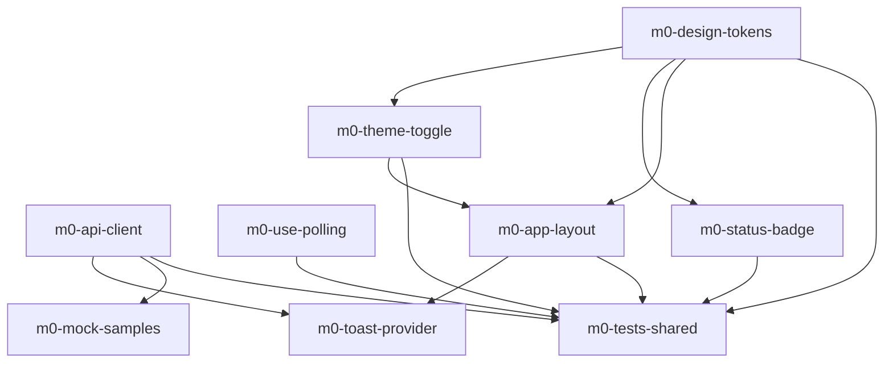

# Task-пакет: module-0-index

Родительский план: [module-0-index.plan.md](../module-0-index.plan.md)

## Задачи

| id | Содержание | depends_on | Статус |
|----|------------|------------|--------|
| m0-design-tokens | light/dark палитра, status CSS vars, шрифты | — | completed |
| m0-theme-toggle | ThemeProvider, ThemeToggle, localStorage | m0-design-tokens | completed |
| m0-status-badge | StatusBadge 8 вариантов | m0-design-tokens | completed |
| m0-api-client | client, timeout, GET-retry, Zod envelope | — | completed |
| m0-use-polling | usePolling hook | — | completed |
| m0-app-layout | AppLayout, Sidebar, routes M17 | m0-design-tokens, m0-theme-toggle | completed |
| m0-toast-provider | sonner, mapApiError | m0-api-client, m0-app-layout | completed |
| m0-mock-samples | fixtures ×5 типов | m0-api-client | completed |
| m0-tests-shared | unit-тесты shared infra | m0-design-tokens, m0-theme-toggle, m0-status-badge, m0-app-layout, m0-api-client, m0-use-polling | completed |

## Граф зависимостей

## Параллельность

**Волна 1** (можно параллельно — нет общих файлов):
- `m0-design-tokens`
- `m0-api-client`
- `m0-use-polling`

**Волна 2** (после `m0-design-tokens`; между собой параллельно):
- `m0-theme-toggle`
- `m0-status-badge`

**Волна 2b** (после `m0-api-client`; параллельно с волной 2):
- `m0-mock-samples`

**Волна 3** (после `m0-theme-toggle`):
- `m0-app-layout`

**Волна 4** (после `m0-app-layout` + `m0-api-client`):
- `m0-toast-provider`

**Финал** (после реализаций волны 1–3 + зависимостей):
- `m0-tests-shared`

## Рекомендуемый порядок (последовательный)

1. m0-design-tokens  
2. m0-api-client ∥ m0-use-polling  
3. m0-theme-toggle ∥ m0-status-badge ∥ m0-mock-samples  
4. m0-app-layout  
5. m0-toast-provider  
6. m0-tests-shared  
