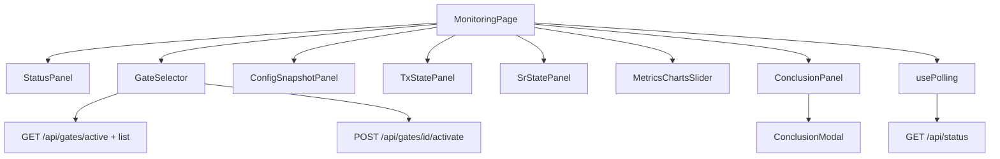

# FE Module 1 — Monitoring (`/monitoring`)

Live-дашборд оператора: снимок последнего тика scheduler и контекст pipeline. Контракт сценария — M17 §7.1; polling — §10.s.

**Зависит от:** [module-0-index.plan.md](./module-0-index.plan.md)

---

## Цель

Дать оператору единый экран «что происходит прямо сейчас»: статус подключения и тика, активный gate, config snapshot, состояния tx/sr, метрики на графиках и вывод агента (Conclusion) — без перехода на другие страницы.

---

## Границы

**Входит:**

- Страница `/monitoring` с polling `GET /api/status`.
- Семь UI-зон (см. §Концепция страницы).
- Active gate: `GET /api/gates/active`, список gates; `POST /api/gates/{gate_id}/activate` с confirm-dialog.
- `config_snapshot`, `tx_state`, `sr_state`, `conclusion` (и поля графиков) — из `GET /api/status` или связанных GET по M17 §10.y / OpenAPI.
- Conclusion: inline-превью + полноэкранный modal overlay (затемнённый backdrop).
- Edge-cases: 503, empty first tick, skipped/error report, длинный conclusion.

**Не входит:**

- Deep chat (module-3); ссылка «Deep analysis →» опциональна в Conclusion modal.
- Telegram delivery status.
- Редактирование `config_snapshot` на сервере (только просмотр/интеракция в UI, если нет POST в контракте).
- Backend изменения.

---

## Концепция страницы (апрув UX)

Один экран, desktop-first (1440px). Токены и light/dark — из module-0. Все зоны обновляются diff при polling, без blink всей страницы.

### 1. Status (подключение и последний тик)

Компактная полоса вверху страницы.

| Элемент | Источник | Поведение |
|---------|----------|-----------|
| Индикатор подключения | polling alive / last successful fetch | `Live` — dot success token (module-0 §операционные); `Stale` — muted; 503 — accent-warn |
| `last_tick_at` | `GET /status` | JetBrains Mono, naive MSK as-is |
| `last_status` | `GET /status` | `StatusBadge` |
| `tick_in_progress` | `GET /status` | Violet pulse dot (module-0); ускоренный polling 2–3 с |
| Manual refresh | — | Кнопка справа; немедленный refetch без сброса interval |

### 2. Gate (номер и имя) — интерактивная

Карточка слева в верхнем ряду.

- Показывает `gate_id` (номер) + human-readable имя/label из `GateInfo`.
- Интерактив: Select/Combobox со списком gates (`GET /api/gates` или аналог M17).
- Смена gate: confirm-dialog → `POST /api/gates/{gate_id}/activate` → refetch status + gates.
- Fail 404 → toast `gate_not_found` через `mapApiError` (module-0); UI gate не менять.

### 3. Config snapshot — интерактивная

Карточка справа от Gate (или на всю ширину под Status на узком viewport).

- Данные: `config_snapshot` из последнего status response.
- Интерактивность: accordion/tree по ключам; expand/collapse секций; copy-to-clipboard на поле; поиск по ключу (optional).
- Длинные значения: truncate в свёрнутом виде, expand inline внутри панели.
- Read-only, если контракт не предусматривает PATCH.

### 4. TX state

Отдельная карточка: структурированный вывод `tx_state` (key-value grid или nested list).

- Заголовок «TX state»; пустое состояние — muted «Нет данных».
- Числа — `tabular-nums`, mono.

### 5. SR state

Аналогично TX: карточка `sr_state`, тот же паттерн отображения.

- TX и SR — в одном ряду 50/50 на desktop; stack на &lt;1024px.

### 6. Графики — переключение через Slider

Широкая зона под state-панелями.

- Несколько chart views (например: объём транзакций, decline rate, latency — по полям M17/OpenAPI).
- Переключение: **Carousel** (shadcn) или горизонтальный **Slider** с dots/arrows; swipe на trackpad опционально.
- Одна активная серия на экране; легенда и оси читаемы в light и dark.
- Библиотека: **Recharts** (зафиксировано в module-0 §Библиотеки UI); без анимации layout при смене слайда — только crossfade opacity 200ms.
- Нет данных → placeholder внутри carousel slide.

### 7. Conclusion (вывод агента) — expand / collapse

Карточка внизу (или правая колонка на ultra-wide).

**Свёрнутое (default на странице):**

- Заголовок «Conclusion» + `StatusBadge` отчёта.
- Превью текста: truncate ~6–8 строк (`line-clamp`); scroll внутри карточки при overflow.
- Кнопка «Развернуть» / icon `Maximize2`.

**Развёрнутое (modal):**

- `Dialog` (shadcn) на весь viewport: `max-w-4xl` или `90vw`, `max-h-[85vh]`, scroll body.
- Backdrop: `bg-background/80` + backdrop-blur лёгкий; клик по backdrop **не** закрывает (только явная «Свернуть» / Esc) — чтобы не потерять контекст случайно.
- Полный текст conclusion; блок `report.error` для skipped/error.
- Кнопка «Свернуть» / `Minimize2` → возврат к inline-карточке без потери scroll position страницы.
- Optional: ссылка «Deep analysis →» на `/deep/{audit_id}` если `audit_id` есть в status.

---

## Layout (desktop 1440)

```
┌─────────────────────────────────────────────────────────────┐
│ StatusPanel — Live dot | last_tick | StatusBadge | Refresh  │
├──────────────────┬──────────────────────────────────────────┤
│ GateSelector     │ ConfigSnapshotPanel                      │
├──────────────────┴──────────────────────────────────────────┤
│ TxStatePanel              │ SrStatePanel                    │
├─────────────────────────────────────────────────────────────┤
│ MetricsChartsSlider — [ ◀ ] Chart 2/4 [ ▶ ] ··· dots      │
├─────────────────────────────────────────────────────────────┤
│ ConclusionPanel — preview … [Развернуть]                    │
└─────────────────────────────────────────────────────────────┘
        ConclusionModal (overlay при expand)
```

Breakpoints: 1024 — TX/SR stack; Gate + Config stack. Mobile — базовая читаемость, carousel свайп.

---

## Промпт дизайна (UI)

```
Контекст: light-default ops dashboard, токены module-0 (violet primary, semantic surfaces).
Цель: оператор видит live snapshot последнего тика в 7 зонах без перегрузки.

Компоненты: Card, Select, Accordion, Carousel, Dialog, StatusBadge, Button, sonner.
Шрифты: Inter UI; timestamps/числа — JetBrains Mono tabular-nums.

Состояния:
- First mount: skeleton по зонам (не один spinner на весь экран).
- Empty (last_tick_at null): StatusPanel + empty copy в Conclusion/графиках.
- 503: amber DegradedBanner под StatusPanel; retry indicator.
- tick_in_progress: pulse на StatusPanel.
- Conclusion modal: focus trap, Esc закрывает, aria-labelledby.

Анимации: 150–200ms colors/opacity; prefers-reduced-motion — без pulse/carousel autoplay.
A11y: каждая Card с aria-label; gate select — keyboard; modal — role=dialog.
```

---

## Ключевые гарантии и инварианты

1. **Live snapshot:** страница = последний тик; не путать с deep chat snapshot (M17 инвариант 2).
2. **Polling:** 5–10 с штатно; 2–3 с при `tick_in_progress=true`; stop on unmount.
3. **503:** exponential backoff 5s → 15s → 30s; баннер degraded, зоны с last good data или placeholders.
4. **Datetime:** naive MSK as-is из API.
5. **skipped/error:** Conclusion пуст или краток; `report.error` виден в ConclusionPanel и modal.
6. **Длинный conclusion:** truncate в карточке; полный текст только в modal.
7. **Gate activate:** confirm → POST → refetch; 404 → toast, UI без изменений.
8. **Тема:** все зоны на semantic tokens; графики и modal корректны в light и dark.

---

## Edge-cases

| Ситуация | Ожидаемое поведение |
|----------|---------------------|
| `GET /status` 503 `scheduler_not_initialized` | DegradedBanner; StatusPanel «Stale»/degraded |
| Пустой тик, `last_tick_at: null` | Empty state в Conclusion и графиках |
| `report.status=skipped` / `error` | StatusBadge + error в Conclusion |
| Длинный `conclusion` | line-clamp в карточке; modal — full scroll |
| `config_snapshot` null / {} | Config panel: «Нет snapshot» |
| `tx_state` / `sr_state` отсутствуют | Muted empty в соответствующей карточке |
| Нет series для графиков | Placeholder slide в carousel |
| `POST /gates/{id}/activate` 404 | Toast `gate_not_found` |
| Tab hidden | Polling ×2 (usePolling) |
| Modal open + новый poll | Обновить conclusion в modal если тот же audit; иначе badge «обновлено» |
| Network fail | StatusPanel stale; Retry на уровне страницы |

---

## Схема



---

## Флоу (клиент ↔ сервер)

1. Mount: `GET /api/gates/active` + список gates → GateSelector.
2. Start polling `GET /api/status` (interval §10.s).
3. Распределить поля response по зонам: status → StatusPanel; `config_snapshot` → Config; `tx_state` / `sr_state` → state panels; chart series → Carousel; `conclusion` / report → ConclusionPanel.
4. Оператор меняет gate → confirm → POST activate → refetch.
5. Оператор «Развернуть» Conclusion → ConclusionModal; «Свернуть» / Esc → inline card.
6. Оператор листает графики → локальный state слайда, без refetch.
7. Unmount: stop polling; закрыть modal если открыт.

---

## Структура

```
src/
├── pages/
│   └── MonitoringPage.tsx
├── components/
│   └── monitoring/
│       ├── StatusPanel.tsx
│       ├── GateSelector.tsx
│       ├── ConfigSnapshotPanel.tsx
│       ├── TxStatePanel.tsx
│       ├── SrStatePanel.tsx
│       ├── MetricsChartsSlider.tsx
│       ├── ConclusionPanel.tsx
│       ├── ConclusionModal.tsx
│       └── DegradedBanner.tsx
├── api/
│   └── monitoring.ts           # getStatus, getGates, getActiveGate, activateGate
└── hooks/
    └── useMonitoringPolling.ts
tests/
├── unit/monitoring/
│   ├── StatusPanel.test.tsx
│   ├── ConclusionModal.test.tsx
│   ├── GateSelector.test.tsx
│   └── useMonitoringPolling.test.ts
└── e2e/monitoring.spec.ts
```

---

## Публичный API

| HTTP (M17 §10.y) | Назначение UI | Зона |
|------------------|---------------|------|
| `GET /api/status` | Scheduler snapshot + config_snapshot + states + conclusion + chart data | Все зоны |
| `GET /api/gates/active` | Текущий gate | GateSelector |
| `GET /api/gates` (или list) | Список для select | GateSelector |
| `POST /api/gates/{gate_id}/activate` | Смена gate | GateSelector |

Точные имена полей (`config_snapshot`, `tx_state`, `sr_state`, series для графиков) — OpenAPI anomaly-api; FE не дублирует схемы.

---

## Тесты

| Сценарий | Уровень | Критерий |
|----------|---------|----------|
| StatusPanel live/stale | unit | Успешный poll → Live; ошибка → Stale |
| tick_in_progress pulse | unit | Pulse dot при true; static при reduced-motion |
| GateSelector activate 404 | unit | Toast; selected gate не меняется |
| ConfigSnapshot expand | unit | Клик секции → раскрытие; copy field |
| Tx/Sr empty | unit | Muted placeholder без crash |
| Charts carousel | unit | Next/prev меняет активный slide |
| Conclusion truncate | unit | line-clamp в panel |
| Conclusion modal | unit | Expand → dialog + backdrop; collapse → panel visible |
| Modal Esc | unit | Esc закрывает modal |
| polling interval switch | unit | tick_in_progress → 2–3s interval |
| 503 banner | unit | DegradedBanner visible |
| e2e tick update | e2e | После fixture poll conclusion обновляется |

---

## DoD

- [ ] `/monitoring` рендерит 7 зон по §Концепция страницы.
- [ ] Polling с ускорением при `tick_in_progress`; stop on unmount.
- [ ] GateSelector: смена gate с confirm и обработкой 404.
- [ ] Conclusion: превью + modal expand/collapse с затемнённым backdrop.
- [ ] Графики переключаются carousel/slider.
- [ ] 503 и empty states по edge-cases.
- [ ] Light + dark корректны на всех зонах.
- [ ] Тесты из раздела «Тесты» реализованы и проходят.
- [ ] Acceptance M17 §9.2 monitoring tick update — готов к staging.

---

## Зависимости

- module-0-index (layout, StatusBadge, ThemeProvider, usePolling, api client)
- M17 §7.1, §10.s
- Backend: `GET /status`, gates (staging)

---

## Артефакты

- `MonitoringPage.tsx`, компоненты `src/components/monitoring/*`
- `api/monitoring.ts`, `useMonitoringPolling.ts`
- Unit + e2e тесты monitoring

---

## Владелец контракта

**Module-1 владеет:** UX и компоненты страницы `/monitoring`.

**Ссылается на:** M17 §7.1; M13 GateInfo; OpenAPI полей status response.
