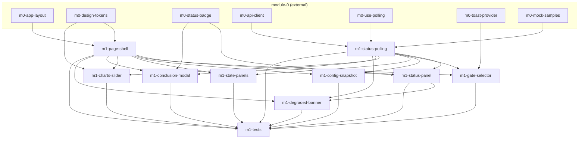

# Task-пакет: module-1-monitoring

Родительский план: [module-1-monitoring.plan.md](../module-1-monitoring.plan.md)

**Внешние зависимости (module-0, все pending):** `m0-app-layout`, `m0-design-tokens`, `m0-status-badge`, `m0-api-client`, `m0-use-polling`, `m0-toast-provider`, `m0-mock-samples`.

## Задачи

| id | Содержание | depends_on | Статус |
|----|------------|------------|--------|
| m1-page-shell | MonitoringPage grid 7 зон, responsive | m0-app-layout, m0-design-tokens | completed |
| m1-status-polling | `getStatus` + `useMonitoringPolling` | m0-api-client, m0-use-polling, m0-mock-samples | completed |
| m1-status-panel | StatusPanel live/stale/pulse/refresh | m1-page-shell, m1-status-polling, m0-status-badge | completed |
| m1-gate-selector | Gate input, activate, 404 toast | m1-page-shell, m1-status-polling, m0-toast-provider | completed |
| m1-config-snapshot | Config tree/accordion, copy | m1-page-shell, m1-status-polling | completed |
| m1-state-panels | TxStatePanel + SrStatePanel | m1-page-shell, m1-status-polling | completed |
| m1-charts-slider | MetricsChartsSlider 7 slides Recharts | m1-page-shell, m1-status-polling, m0-design-tokens | completed |
| m1-conclusion-modal | ConclusionPanel + ConclusionModal | m1-page-shell, m1-status-polling, m0-status-badge | completed |
| m1-degraded-banner | DegradedBanner 503 + empty first tick | m1-page-shell, m1-status-polling, m1-status-panel | completed |
| m1-tests | Vitest + e2e monitoring | все m1-* выше | completed |

## Граф зависимостей

## Параллельность

**После module-0 (критический путь m0):**

**Волна 1** — параллельно, разные файлы:
- `m1-page-shell`
- `m1-status-polling`

**Волна 2** — после волны 1; компонентные файлы можно писать параллельно, но **wire в `MonitoringPage.tsx` — последовательно** (общий файл):
- `m1-status-panel` (первым — подключает hook к странице)
- `m1-gate-selector` ∥ `m1-config-snapshot` ∥ `m1-state-panels` ∥ `m1-charts-slider` ∥ `m1-conclusion-modal` — только если координация правок `MonitoringPage.tsx` (рекомендуется последовательный порядок по таблице)

**Волна 3** — после `m1-status-panel`:
- `m1-degraded-banner`

**Финал:**
- `m1-tests`

## Рекомендуемый порядок (последовательный)

1. m1-page-shell ∥ m1-status-polling  
2. m1-status-panel  
3. m1-gate-selector  
4. m1-config-snapshot  
5. m1-state-panels  
6. m1-charts-slider  
7. m1-conclusion-modal  
8. m1-degraded-banner  
9. m1-tests  
