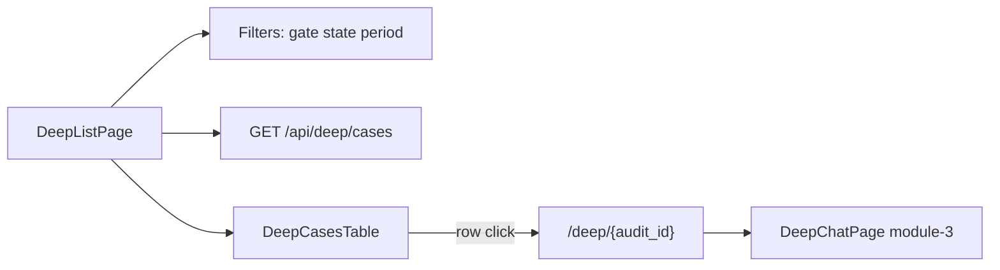

# FE Module 2 — Deep List (`/deep`)

Каталог deep analytics: список audits с фильтрами и переходом в чат с агентом. Контракт — M17 §7.2.

**Зависит от:** [module-0-index.plan.md](./module-0-index.plan.md)

---

## Цель

Дать оператору обзор всех deep cases: найти нужный audit через фильтры и провалиться в сессию общения с агентом по `audit_id`.

---

## Границы

**Входит:**

- Страница `/deep` — **список** audits.
- Фильтры сверху: gate, state чата, период.
- `GET /api/deep/cases?gate_id=&state=&from=&to=&page=&page_size=`.
- Таблица/список с projection `DeepCaseSummary` (поля — OpenAPI M8).
- Pagination + sync query params в URL.
- Navigate на `/deep/{audit_id}` — чат (module-3).

**Не входит:**

- UI чата с агентом (module-3).
- Мутации чата, создание cases.

---

## Концепция страницы (апрув UX)

Две связанные страницы раздела **Deep**:

| Страница | Маршрут | Назначение |
|----------|---------|------------|
| **Список** | `/deep` | Каталог audits + фильтры |
| **Чат** | `/deep/{audit_id}` | Общение с агентом (module-3) |

Операторский флоу: **фильтр → найти audit → клик → чат**.

### Список audits (`/deep`)

**Верх страницы — панель фильтров** (full-width grid, кнопки Apply/Reset справа снизу).

| Фильтр | Тип | Query param | Поведение |
|--------|-----|-------------|-----------|
| Gate | Input (только цифры) | `gate_id` | Ввод фильтрует нецифровые; валидация на Apply; server filter |
| State | Select | `state` | Все / `deep_chat_state` enum; server filter |
| Период | Text from / to | `from`, `to` | Placeholder `yyyy-mm-dd`; валидация формата и `to >= from`; naive MSK |
| Действия | Apply + Reset | — | Apply → refetch `page=1`; Reset → очистка + URL |

Фильтры в URL — shareable link на отфильтрованный список.

**Основная область — список audits** (data-dense table, desktop-first). Высота страницы фиксирована под viewport; **вертикальный скролл только внутри блока таблицы** (`.deep-table-scroll`).

Колонки (основная информация по каждому audit):

| Колонка | Поле | Отображение |
|---------|------|-------------|
| Time | `created_at` | JetBrains Mono, as-is |
| Gate | `gate_id` | Chip (mono), centered |
| Event | `event_summary` | Truncate + tooltip |
| Conclusion | `conclusion` | Truncate + tooltip |
| State | `deep_chat_state` | `StatusBadge` — варианты module-0 §Deep chat |

- Заголовки колонок — `text-center`.
- Row height ~36px; sticky header внутри scroll-контейнера.
- Row **кликабельна** целиком → `navigate(/deep/{audit_id})`; hover `bg-muted/40`, cursor pointer.
- `deep_chat_state=not_started` — строка кликабельна; на чате CTA «Открыть анализ» (module-3).

**Pagination** внизу viewport: «Показано X–Y из total» + prev/next (мягкий hover) + page size 20/50 (focus ring как у фильтров).

### Провал в audit (навигация)

- Клик по строке / Enter на focused row → `/deep/{audit_id}`.
- Breadcrumb на чате: `Deep` → `{audit_id short}` (module-3).
- Кнопка «Назад к списку» сохраняет query фильтров в URL при return (`/deep?gate_id=…`).

---

## Layout (desktop 1440)

```
┌─────────────────────────────────────────────────────────────┐
│ Deep Analytics — каталог audits                             │
├─────────────────────────────────────────────────────────────┤
│ [ Gate ] [ State ] [ From ] [ To ]                          │
│                                    [ Apply ] [ Reset ]      │  ← фильтры
├─────────────────────────────────────────────────────────────┤
│ Time   │ Gate │ Event      │ Conclusion   │ State │         │↕ scroll
│ ...    │ ...  │ ...        │ ...          │ Badge │         │  внутри
├─────────────────────────────────────────────────────────────┤
│ Показано 1–20 из 30                         ◀  1  ▶  20/pg │
└─────────────────────────────────────────────────────────────┘
```

Токены light/dark — module-0.

---

## Промпт дизайна (UI)

```
Контекст: light-default ops dashboard, module-0 tokens.
Цель: быстро найти audit и провалиться в чат с агентом.

Filter bar: Card elevated, p-4, grid 4 cols full-width; labels visible; кнопки справа снизу.
Table: truncate + title tooltip; scroll внутри card; scrollbar 5px muted.
Pagination: мягкий hover nav-кнопок; focus ring select как у фильтров.

Состояния:
- Loading: skeleton 8 rows + filter placeholders.
- Empty no filters: «Нет deep cases».
- Empty with filters: «Нет audits по фильтру» + Reset.
- Error: inline alert + Retry.

Анимации: row hover 200ms colors; reduced-motion — без transition.
A11y: table aria-label «Deep audits»; row keyboard Enter; фильтры с labels.
Out of scope: inline chat preview, bulk actions, export.
```

---

## Ключевые гарантии и инварианты

1. **Snapshot catalog:** список ≠ live monitoring; данные M8 deep cases API.
2. **Основная информация** в списке — без `audit_id` в таблице; полный текст в чате / snapshot meta.
3. **Фильтры** gate (digits), state, period — server query; валидация на клиенте перед Apply.
4. **Pagination** server-side из envelope; fixture dev — client-side slice после filter.
5. **URL sync** для всех фильтров и `page` / `page_size`.
6. **Каждый audit кликабелен** независимо от `deep_chat_state`.
7. **Datetime** naive MSK as-is; ввод дат `yyyy-mm-dd`.
8. **Viewport layout:** страница не растёт выше экрана; скролл таблицы внутри card.

---

## Edge-cases

| Ситуация | Ожидаемое поведение |
|----------|---------------------|
| Пустой список без фильтров | «Нет deep cases» |
| Пустой список с фильтром | «Нет audits по фильтру» + Reset |
| Невалидный gate / дата при Apply | Inline ошибка под полем; URL не меняется |
| `to < from` | Ошибка на поле To |
| Invalid page > total | Clamp на last page (`replace` URL) |
| API error | Inline error + Retry |
| Длинный conclusion | Truncate в таблице |
| Return из чата | Back → `/deep` с `deepListSearch` в location state (module-3) |

---

## Схема



---

## Флоу (клиент ↔ сервер)

1. Mount: parse URL → filters + page.
2. `GET /api/deep/cases` с query params.
3. Render filter bar + table + pagination.
4. User меняет gate/state/period → Apply → URL update → refetch `page=1`.
5. User кликает строку → `navigate(/deep/${audit_id})` с `deepListSearch`.
6. На чате «Назад» → `navigate(/deep?${savedSearch})` (module-3).

---

## Структура

```
src/
├── pages/
│   └── DeepListPage.tsx
├── components/
│   └── deep/
│       ├── DeepCasesFilters.tsx
│       ├── DeepCasesTable.tsx
│       └── DeepCasesPagination.tsx
├── hooks/
│   └── useDeepCasesList.ts
├── lib/
│   └── deepCasesFiltersValidation.ts
├── api/
│   └── deep.ts                 # listDeepCases (+ Zod parseDeepCaseSummary)
└── api/fixtures/
    └── deepCaseSummary.ts      # deepCasesListFixture (30 rows dev)
tests/
├── unit/deep-list/
└── e2e/deep-list.spec.ts
```

---

## Публичный API

| HTTP | Назначение | Owner |
|------|------------|-------|
| `GET /api/deep/cases` | Список audits + pagination | M8 |

Query (server, M8): `gate_id`, `state`, `from`, `to`, `page`, `page_size`. Тип строки: `DeepCaseSummary` (`parseDeepCaseSummary`).

Dev fixture: `deepCasesListFixture` — 30 записей, client-side filter + pagination без API.

---

## Тесты

| Сценарий | Уровень | Критерий |
|----------|---------|----------|
| Render list from fixture | unit | N rows, StatusBadge per chat state |
| gate_id filter URL sync | unit | `?gate_id=` после Apply → refetch |
| Date validation blocks Apply | unit | невалидная дата → ошибка, без onApply |
| validateDeepCasesFilters | unit | gate, yyyy-mm-dd, to < from |
| Pagination next/prev | unit | page param меняется |
| Row navigate | unit | click / Enter → onRowClick(audit_id) |
| deepListSearch on navigate | unit | location.state при row click |
| e2e gate filter | e2e | 20 rows → gate 42 → 15 rows (fixture 30) |

---

## DoD

- [x] Список audits с основными полями и фильтрами сверху (gate, state, period).
- [x] URL sync для фильтров и page.
- [x] Клик по audit → `/deep/{audit_id}`.
- [x] Empty/error states; viewport-contained table scroll.
- [x] Тесты проходят; docs `docs/modules/module-2-deep-list.md`.

---

## Зависимости

- module-0-index (layout, StatusBadge, api client, `deepCaseSummary` fixture)
- module-1-monitoring (completed): gate input UX (digits only); cross-link «Deep analysis →» из `ConclusionModal` ведёт на `/deep/{audit_id}` (module-3)
- M17 §7.2; M8 DeepCaseSummary

**Downstream:** module-3-deep-chat (drill-down target из списка)

---

## Артефакты

- `DeepListPage.tsx`, `components/deep/*`, `api/deep.ts`, `hooks/useDeepCasesList.ts`, `lib/deepCasesFiltersValidation.ts`, `docs/modules/module-2-deep-list.md`

---

## Владелец контракта

**Module-2 владеет:** UX страницы `/deep` (список audits + фильтры).

**Ссылается на:** M17 §7.2; M8 OpenAPI.
