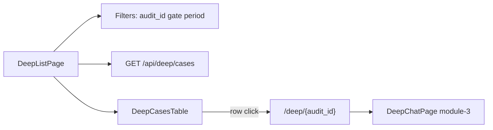

# FE Module 2 — Deep List (`/deep`)

Каталог deep analytics: список audits с фильтрами и переходом в чат с агентом. Контракт — M17 §7.2.

**Зависит от:** [module-0-index.plan.md](./module-0-index.plan.md)

---

## Цель

Дать оператору обзор всех deep cases: найти нужный audit через фильтры и провалиться в сессию общения с агентом по `audit_id`.

---

## Границы

**Входит:**

- Страница `/deep` — **список** audits.
- Фильтры сверху: поиск по audit, gate, периоду.
- `GET /api/deep/cases?audit_id=&gate_id=&from=&to=&page=&page_size=`.
- Таблица/список с projection `DeepCaseSummary` (поля — OpenAPI M8).
- Pagination + sync query params в URL.
- Navigate на `/deep/{audit_id}` — чат (module-3).

**Не входит:**

- UI чата с агентом (module-3).
- Мутации чата, создание cases.

---

## Концепция страницы (апрув UX)

Две связанные страницы раздела **Deep**:

| Страница | Маршрут | Назначение |
|----------|---------|------------|
| **Список** | `/deep` | Каталог audits + фильтры |
| **Чат** | `/deep/{audit_id}` | Общение с агентом (module-3) |

Операторский флоу: **фильтр → найти audit → клик → чат**.

### Список audits (`/deep`)

**Верх страницы — панель фильтров** (sticky под AppLayout header на scroll).

| Фильтр | Тип | Query param | Поведение |
|--------|-----|-------------|-----------|
| Audit | Input / search | `audit_id` | Поиск по id (полный UUID или prefix, если API поддерживает) |
| Gate | Combobox | `gate_id` | Список gates |
| Период | Date from / to | `from`, `to` | Naive MSK, без TZ-конвертации |
| Действия | Apply + Reset | — | Apply → refetch `page=1`; Reset → очистка + URL |

Фильтры в URL — shareable link на отфильтрованный список.

**Основная область — список audits** (data-dense table, desktop-first).

Колонки (основная информация по каждому audit):

| Колонка | Поле | Отображение |
|---------|------|-------------|
| Время | `created_at` / event time | JetBrains Mono |
| Audit | `audit_id` | Short id (первые 8 символов) + tooltip full UUID |
| Gate | `gate_id` + label | Chip |
| Событие | event summary | Truncate ~60ch |
| Conclusion | conclusion excerpt | Truncate ~80ch |
| Чат | `deep_chat_state` | `StatusBadge` — варианты module-0 §Deep chat (`not_started`, `active`, `awaiting_approval`, `completed`, `error`, `cancelled`) |

- Row height ~36px; sticky header.
- Row **кликабельна** целиком → `navigate(/deep/{audit_id})`; hover `bg-muted/40`, cursor pointer, chevron `→` справа.
- `deep_chat_state=not_started` — строка всё равно кликабельна; на чате будет CTA «Начать диалог».

**Pagination** внизу: «Показано X–Y из total» + prev/next + page size 20/50.

### Провал в audit (навигация)

- Клик по строке / Enter на focused row → `/deep/{audit_id}`.
- Breadcrumb на чате: `Deep` → `{audit_id short}` (module-3).
- Кнопка «Назад к списку» сохраняет query фильтров в URL при return (`/deep?gate_id=…`).

---

## Layout (desktop 1440)

```
┌─────────────────────────────────────────────────────────────┐
│ Deep Analytics — каталог audits                             │
├─────────────────────────────────────────────────────────────┤
│ [ Audit id ___ ] [ Gate ▼ ] [ From ] [ To ]  Apply  Reset  │  ← фильтры
├─────────────────────────────────────────────────────────────┤
│ Time      │ Audit    │ Gate │ Event    │ Conclusion │ State │ →
│ ...       │ ...      │ ...  │ ...      │ ...        │ Badge │
├─────────────────────────────────────────────────────────────┤
│ Показано 1–20 из 142                    ◀  1  2  3  ▶  50/pg │
└─────────────────────────────────────────────────────────────┘
```

Токены light/dark — module-0.

---

## Промпт дизайна (UI)

```
Контекст: light-default ops dashboard, module-0 tokens.
Цель: быстро найти audit и провалиться в чат с агентом.

Filter bar: Card elevated, p-4, grid 4 cols + actions; labels visible.
Table: shadcn Table + TanStack; truncate + optional tooltip on hover.
Pagination: без flash (keepPreviousData / placeholder rows).

Состояния:
- Loading: skeleton 8 rows + filter placeholders.
- Empty no filters: «Нет deep cases».
- Empty with filters: «Нет audits по фильтру» + Reset.
- Error: inline alert + Retry.

Анимации: row hover 200ms colors; reduced-motion — без transition.
A11y: table aria-label «Deep audits»; row keyboard Enter; фильтры с labels.
Out of scope: inline chat preview, bulk actions, export.
```

---

## Ключевые гарантии и инварианты

1. **Snapshot catalog:** список ≠ live monitoring; данные M8 deep cases API.
2. **Основная информация** в списке — без полного conclusion; полный текст в чате / snapshot meta.
3. **Фильтр audit_id** — primary search; gate и period — secondary.
4. **Pagination** server-side из envelope; не client-side slice.
5. **URL sync** для всех фильтров и `page`.
6. **Каждый audit кликабелен** независимо от `deep_chat_state`.
7. **Datetime** naive MSK as-is.

---

## Edge-cases

| Ситуация | Ожидаемое поведение |
|----------|---------------------|
| Пустой список без фильтров | «Нет deep cases» |
| Пустой список с фильтром | «Нет audits по фильтру» + Reset |
| Невалидный `audit_id` в фильтре | Empty result или API validation error → toast |
| Invalid page > total | Clamp last page или reset `page=1` |
| API error | Inline error + Retry |
| Длинный conclusion | Truncate в таблице |
| Return из чата | Back → `/deep` с сохранёнными query params |

---

## Схема



---

## Флоу (клиент ↔ сервер)

1. Mount: parse URL → filters + page.
2. `GET /api/deep/cases` с query params.
3. Render filter bar + table + pagination.
4. User меняет фильтр → Apply → URL update → refetch `page=1`.
5. User кликает audit → `navigate(/deep/${audit_id})`.
6. На чате «Назад» → `navigate(/deep?${savedSearch})`.

---

## Структура

```
src/
├── pages/
│   └── DeepListPage.tsx
├── components/
│   └── deep/
│       ├── DeepCasesFilters.tsx
│       ├── DeepCasesTable.tsx
│       └── DeepCasesPagination.tsx
├── api/
│   └── deep.ts                 # listDeepCases
tests/
├── unit/deep-list/
└── e2e/deep-list.spec.ts
```

---

## Публичный API

| HTTP | Назначение | Owner |
|------|------------|-------|
| `GET /api/deep/cases` | Список audits + pagination | M8 |

Query: `audit_id`, `gate_id`, `from`, `to`, `page`, `page_size`. Тип строки: `DeepCaseSummary`.

---

## Тесты

| Сценарий | Уровень | Критерий |
|----------|---------|----------|
| Render list from fixture | unit | N rows, StatusBadge per chat state |
| audit_id filter URL sync | unit | `?audit_id=` после Apply |
| gate_id filter URL sync | unit | `?gate_id=` после Apply |
| Pagination next/prev | unit | page param меняется |
| Row navigate | unit | click → `/deep/uuid` |
| Back preserves filters | unit | return URL содержит query |
| e2e audit filter | e2e | Фильтр сужает список (fixture) |

---

## DoD

- [ ] Список audits с основными полями и фильтрами сверху (audit, gate, period).
- [ ] URL sync для фильтров и page.
- [ ] Клик по audit → `/deep/{audit_id}`.
- [ ] Empty/error states.
- [ ] Тесты проходят; M17 §9.2 deep list готов к staging.

---

## Зависимости

- module-0-index
- module-3-deep-chat (downstream: drill-down target)
- M17 §7.2; M8 DeepCaseSummary

---

## Артефакты

- `DeepListPage.tsx`, `components/deep/*`, `api/deep.ts`

---

## Владелец контракта

**Module-2 владеет:** UX страницы `/deep` (список audits + фильтры).

**Ссылается на:** M17 §7.2; M8 OpenAPI.
