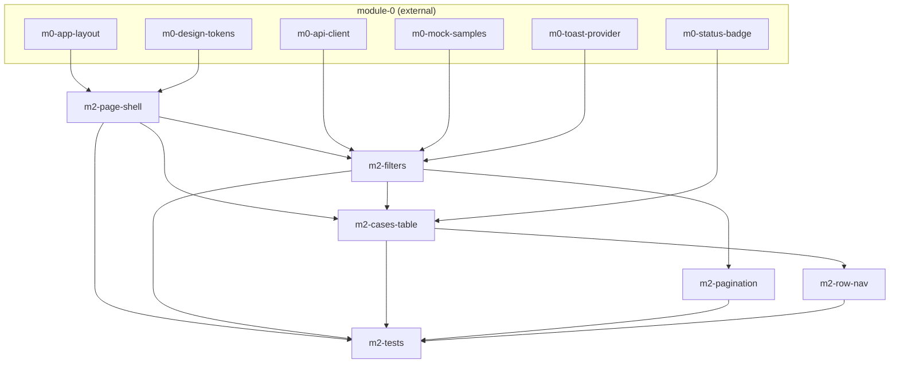

# Task-пакет: module-2-deep-list

Родительский план: [module-2-deep-list.plan.md](../module-2-deep-list.plan.md)

**Внешние зависимости (module-0, completed):** `m0-app-layout`, `m0-design-tokens`, `m0-status-badge`, `m0-api-client`, `m0-toast-provider`, `m0-mock-samples`.

**Upstream (module-1, completed):** gate digits input UX; cross-link «Deep analysis →» в `ConclusionModal`.

## Задачи

| id | Содержание | depends_on | Статус |
|----|------------|------------|--------|
| m2-page-shell | DeepListPage layout filter+table+pagination | m0-app-layout, m0-design-tokens | pending |
| m2-filters | Filters + listDeepCases + URL sync | m2-page-shell, m0-api-client, m0-mock-samples, m0-toast-provider | pending |
| m2-cases-table | DeepCasesTable колонки + StatusBadge | m2-page-shell, m2-filters, m0-status-badge | pending |
| m2-pagination | Envelope pagination prev/next + page size | m2-filters | pending |
| m2-row-nav | Row click → /deep/{audit_id} | m2-cases-table | pending |
| m2-tests | Vitest + e2e deep-list | все m2-* выше | pending |

## Граф зависимостей

## Параллельность

**Волна 1:**
- `m2-page-shell`

**Волна 2** (после shell):
- `m2-filters`

**Волна 3** (после filters; wire в `DeepListPage.tsx` — последовательно):
- `m2-cases-table`
- `m2-pagination` (можно параллельно с table — разные файлы, но общий parent page)

**Волна 4:**
- `m2-row-nav`

**Финал:**
- `m2-tests`

## Рекомендуемый порядок (последовательный)

1. m2-page-shell  
2. m2-filters  
3. m2-cases-table  
4. m2-pagination  
5. m2-row-nav  
6. m2-tests  
