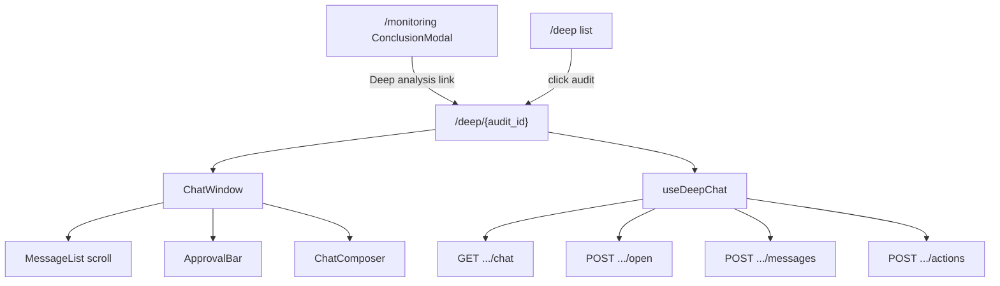
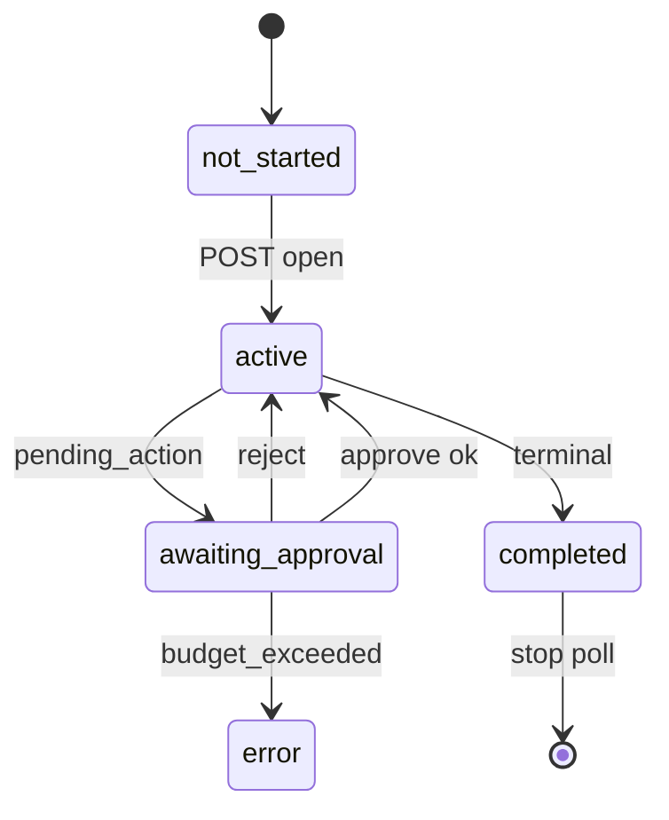

# FE Module 3 — Deep Chat (`/deep/{audit_id}`)

Провал в audit: **стандартное окно общения с LLM-агентом** по snapshot case. HTTP polling + human-in-the-loop approve. Контракт — M17 §7.3, §10.s.

**Зависит от:** [module-0-index.plan.md](./module-0-index.plan.md), [module-2-deep-list.plan.md](./module-2-deep-list.plan.md) (**completed**)

### Контракт входа из module-2 (read-only)

Владелец — M2 (`docs/modules/module-2-deep-list.md`). M3 **не** меняет list, только потребляет:

| Событие | Реализация M2 | Ожидание M3 |
|---------|---------------|-------------|
| Клик по строке списка | `navigate(/deep/{audit_id}, { state: { deepListSearch } })` | Breadcrumb «Deep» → `/deep?${deepListSearch}` |
| `deepListSearch` | `searchParams.toString()` на момент клика (`gate_id`, `state`, `from`, `to`, `page`, `page_size`) | Читать из `location.state.deepListSearch` |
| Прямой URL / ConclusionModal | Без `location.state` | Breadcrumb «Deep» → `/deep` (без query) |

---

## Цель

После выбора audit из списка дать оператору привычный chat UX: история сообщений, поле ввода снизу, ответы агента в реальном времени (polling), approve/reject для tool actions.

---

## Границы

**Входит:**

- Страница `/deep/{audit_id}` — drill-down из module-2.
- **ChatWindow** — классический LLM-интерфейс (как ChatGPT / Claude web).
- `GET/POST` deep chat routes M16 (§10.y).
- `useDeepChat` — polling по `ChatSnapshot.state`.
- Approval bar при `pending_action`.
- Compact meta strip (audit, gate, время) — не отдельный sidebar.
- Link на usage; terminal read-only; stop polling on unmount.

**Не входит:**

- Список audits (module-2).
- WebSocket/SSE, streaming tokens.
- Optimistic UI для approve/message.
- MCP secrets в UI.

---

## Концепция страницы (апрув UX)

### Вход с списка

Оператор на `/deep` выбирает audit → `/deep/{audit_id}` → сразу видит чат (или CTA «Открыть анализ»).

Альтернативный вход: ссылка «Deep analysis →» в `ConclusionModal` на `/monitoring` (module-1) при наличии `audit_id` в status.

### Стандартное окно общения с LLM

Один вертикальный столбец на всю высоту content area (без бокового sidebar с meta).

```
┌─────────────────────────────────────────────────────────────┐
│ ← Deep    audit_abc…    StatusBadge    Расход токенов       │  header
│ gate: 42 · 2025-07-14 12:30 MSK                             │  compact meta (1 line)
├─────────────────────────────────────────────────────────────┤
│                                                             │
│  [Assistant bubble]                                         │
│                    [User bubble]                              │
│  [Tool/system compact block]                                │
│  [Assistant bubble]                                         │
│                                                             │
│                    ↑ scroll area (flex-1)                   │
│                                                             │
├─────────────────────────────────────────────────────────────┤
│ ⚠ Pending: tool_name — args summary   [Approve] [Reject]    │  conditional
├─────────────────────────────────────────────────────────────┤
│ [ Сообщение агенту...                              ] [Send] │  composer
└─────────────────────────────────────────────────────────────┘
```

#### Header

- Breadcrumb: `Deep` (link → `/deep?${deepListSearch}` если есть `location.state.deepListSearch`, иначе `/deep`) / `{audit_id short}` (первые 8 символов UUID).
- `StatusBadge(chat.state)` — варианты module-0 §Deep chat (`not_started` … `cancelled`).
- Link «Расход токенов» → `/usage?audit_id=`.

#### Compact meta strip

Одна строка под header: `gate_id`, event time (mono MSK). Optional collapse chevron если нужен conclusion excerpt (read-only, truncate 2 lines max) — **не** отдельная колонка 280px.

#### Messages (scroll area)

| Роль | Layout | Стиль |
|------|--------|-------|
| `user` | Справа | Bubble `bg-primary/10`, rounded-2xl, max-w-[80%] |
| `assistant` | Слева | Bubble `bg-card` border, max-w-[80%] |
| `system` / `tool` | По центру или слева compact | Mono, `border-l-2` amber если контекст approval |

- Auto scroll-to-bottom при новых сообщениях (если user не scrolled up — optional «N новых» chip).
- Длинный текст: scroll внутри bubble или pre-wrap; без WYSIWYG.

#### Composer (низ, sticky)

- `Textarea` одна строка с auto-grow (max 4 rows) + кнопка **Send** (или Enter без Shift).
- Placeholder по state: «Напишите агенту…» / «Ожидание подтверждения…» / скрыт в terminal.
- **Disabled** при `pending_action != null` или terminal state.

#### Approval bar

Между messages и composer, sticky.

- Показывается только при `pending_action`: tool name + args summary (без секретов).
- **Approve** (primary) / **Reject** (outline destructive).
- Amber border-top для визуального акцента.

### Состояния чата

| `deep_chat_state` | UI |
|-------------------|-----|
| `not_started` | Пустой чат + centered CTA «Открыть анализ» → POST open |
| `active` | Composer enabled; pulse на StatusBadge (module-0) |
| `awaiting_approval` | Composer disabled; ApprovalBar visible |
| `completed` / `cancelled` / `error` | Composer hidden; banner «Диалог завершён»; история read-only |
| `budget_exceeded` (409) | Toast + error banner; Approve скрыт |

---

## Промпт дизайна (UI)

```
Контекст: light-default ops dashboard; фокус — знакомый LLM chat, не custom split-panel.
Референс UX: ChatGPT / Claude — messages scroll + input bottom.

Высота: ChatWindow = 100vh - AppLayout header - page header (~calc).
Компоненты: ScrollArea, Textarea, Button, StatusBadge, ChatMessage, ApprovalBar.

Состояния not_started: иллюстрация не нужна — текст + primary CTA.
Terminal: muted banner над composer area; messages остаются scrollable.

Анимации: new message fade-in 200ms; composer focus ring; reduced-motion — instant.
A11y: messages aria-live polite; Send aria-label; approve/reject с action_id.
Out of scope: markdown editor, file upload, voice input, sidebar case panel.
```

---

## Ключевые гарантии и инварианты

1. **Drill-down:** вход в чат — из списка `/deep`, direct URL `/deep/{audit_id}` или ссылка «Deep analysis →» с `/monitoring` (module-1 `ConclusionModal`).
2. **LLM layout:** composer всегда внизу; messages выше; не переставлять на mobile (stack тот же).
3. **Immutable audit snapshot** + mutable только `deep_chat` (M17 инвариант 2).
4. **Polling:** active 1–2s; awaiting_approval 3–5s; terminal — stop.
5. **After POST:** immediate GET snapshot, then interval by state.
6. **`pending_action`:** composer disabled; ApprovalBar visible.
7. **409 message + pending:** refetch; draft preserved.
8. **409 budget_exceeded:** toast; hide approve.
9. **Unmount:** stop polling.
10. **Back to list:** восстановить query списка через `location.state.deepListSearch` (контракт M2).

---

## Edge-cases

| Ситуация | Ожидаемое поведение |
|----------|---------------------|
| `not_started` | Empty chat + CTA «Открыть анализ» |
| POST message при pending | 409 → refetch; draft сохранён |
| Approve → budget_exceeded | 409 toast; error state |
| Terminal | Stop poll; read-only history |
| Уход со страницы | Stop timers |
| Invalid audit_id 404 | Page error + link «К списку» |
| Очень длинная история | Scroll; optional load-more если API paginates messages |
| Tab hidden | Polling ×2 (usePolling base) |

---

## Схема





---

## Флоу (клиент ↔ сервер)

1. Navigate из list → mount `DeepChatPage`.
2. `GET .../chat` или CTA if `not_started`.
3. Open: `POST .../chat/open` → messages + start polling.
4. User пишет → `POST .../messages` → immediate GET → poll while active.
5. Pending → ApprovalBar → Approve/Reject → POST → GET.
6. Terminal → stop poll; read-only.
7. Back → `/deep?${deepListSearch}` если `location.state.deepListSearch` задан (из списка), иначе `/deep`.
8. Unmount → stop polling.

---

## Структура

```
src/
├── pages/
│   └── DeepChatPage.tsx
├── components/
│   └── deep/
│       ├── DeepCasesFilters.tsx      # M2 (list)
│       ├── DeepCasesTable.tsx        # M2
│       ├── DeepCasesPagination.tsx   # M2
│       ├── ChatWindow.tsx            # messages + approval + composer shell
│       ├── ChatMessage.tsx
│       ├── ChatComposer.tsx
│       ├── ApprovalBar.tsx
│       └── CaseMetaStrip.tsx         # compact 1-line meta, не sidebar
├── hooks/
│   ├── useDeepCasesList.ts           # M2
│   └── useDeepChat.ts                # паттерн как useMonitoringPolling (module-1)
├── api/
│   ├── deep.ts                       # M2 listDeepCases
│   └── deepChat.ts
tests/
├── unit/deep-list/                   # M2
├── unit/deep-chat/
└── e2e/deep-chat.spec.ts
```

---

## Публичный API

| HTTP | Назначение | Owner |
|------|------------|-------|
| `GET /api/deep/cases/{audit_id}/chat` | Polling snapshot | M16 |
| `POST .../chat/open` | Open session | M16 |
| `POST .../chat/messages` | User message | M16 |
| `POST .../actions/{action_id}/approve` | Approve | M16 |
| `POST .../actions/{action_id}/reject` | Reject | M16 |

OpenAPI tag: `deep_analyst`. Тип: `ChatSnapshot`.

---

## Тесты

| Сценарий | Уровень | Критерий |
|----------|---------|----------|
| LLM layout | unit | Composer внизу; messages area flex-1 |
| not_started CTA | unit | «Открыть анализ» visible; open → messages |
| pending blocks input | unit | textarea disabled |
| approve flow mock | unit | POST approve → refetch |
| polling stop terminal | unit | completed → no GET |
| unmount stop | unit | clearInterval |
| breadcrumb back | unit | Link `Deep` → `/deep?gate_id=42&page=1` при `state.deepListSearch` |
| e2e list → chat → message | e2e | Row click → chat; breadcrumb back → тот же query |

---

## DoD

- [ ] Drill-down из list открывает стандартный LLM chat layout.
- [ ] Open / message / approve / reject на mock/fixture.
- [ ] Polling §10.s; stop terminal + unmount.
- [ ] `pending_action` блокирует composer.
- [ ] Back восстанавливает query списка через `deepListSearch` (M2 contract).
- [ ] Тесты проходят; M17 §9.2 deep chat готов.

---

## Зависимости

- module-0-index (StatusBadge, usePolling, api client, theme)
- module-1-monitoring (completed): cross-link `ConclusionModal` → `/deep/{audit_id}`; образец domain polling hook (`useMonitoringPolling`)
- module-2-deep-list (**completed**): drill-down из списка; `location.state.deepListSearch` для breadcrumb back; `listDeepCases` / `DeepCaseSummary` — read-only
- M17 §7.3, §10.s; M16 ChatSnapshot

---

## Артефакты

- `DeepChatPage.tsx`, `ChatWindow.tsx`, `useDeepChat.ts`, `api/deepChat.ts`

---

## Владелец контракта

**Module-3 владеет:** UX `/deep/{audit_id}` — чат с агентом, useDeepChat, chat components.

**Ссылается на:** M17 §7.3; M16; M8 audit snapshot types.
