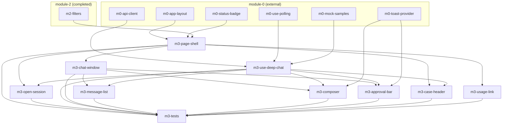

# Task-пакет: module-3-deep-chat

Родительский план: [module-3-deep-chat.plan.md](../module-3-deep-chat.plan.md)

**Внешние зависимости (module-0, completed):** `m0-app-layout`, `m0-status-badge`, `m0-api-client`, `m0-use-polling`, `m0-toast-provider`, `m0-mock-samples`.

**Upstream (module-2, completed):** `m2-filters` — `location.state.deepListSearch` для breadcrumb back (`docs/modules/module-2-deep-list.md`); module-1 `ConclusionModal` → `/deep/{audit_id}` без state; `useMonitoringPolling` как образец domain hook.

## Задачи

| id | Содержание | depends_on | Статус |
|----|------------|------------|--------|
| m3-page-shell | DeepChatPage header + breadcrumb + slots | m0-app-layout, m0-status-badge, m2-filters (done) | completed |
| m3-use-deep-chat | useDeepChat + api/deepChat.ts | m0-api-client, m0-use-polling, m0-mock-samples | completed |
| m3-open-session | CTA «Открыть анализ» + POST open | m3-page-shell, m3-use-deep-chat | completed |
| m3-chat-window | ChatWindow LLM layout shell | m3-page-shell | completed |
| m3-message-list | ChatMessage list + scroll | m3-chat-window, m3-use-deep-chat | completed |
| m3-composer | ChatComposer textarea + Send | m3-chat-window, m3-use-deep-chat, m0-toast-provider | completed |
| m3-approval-bar | ApprovalBar Approve/Reject | m3-chat-window, m3-use-deep-chat, m0-toast-provider | completed |
| m3-case-header | CaseMetaStrip gate + время | m3-page-shell, m3-use-deep-chat | completed |
| m3-usage-link | Link → /usage?audit_id= | m3-page-shell | completed |
| m3-tests | Vitest + e2e deep-chat | все m3-* выше | completed |

## Граф зависимостей

## Параллельность

**Волна 1** (параллельно — разные файлы):
- `m3-page-shell`
- `m3-use-deep-chat`

**Волна 2** (после page shell):
- `m3-chat-window`
- `m3-case-header` ∥ `m3-usage-link` (после hook для case-header)

**Волна 3** (после chat-window + hook):
- `m3-open-session`
- `m3-message-list` ∥ `m3-composer` ∥ `m3-approval-bar` — координация `ChatWindow.tsx` (рекомендуется последовательно: messages → approval → composer)

**Финал:**
- `m3-tests`

## Рекомендуемый порядок (последовательный)

1. m3-page-shell ∥ m3-use-deep-chat  
2. m3-chat-window  
3. m3-case-header, m3-usage-link  
4. m3-open-session  
5. m3-message-list  
6. m3-approval-bar  
7. m3-composer  
8. m3-tests  
