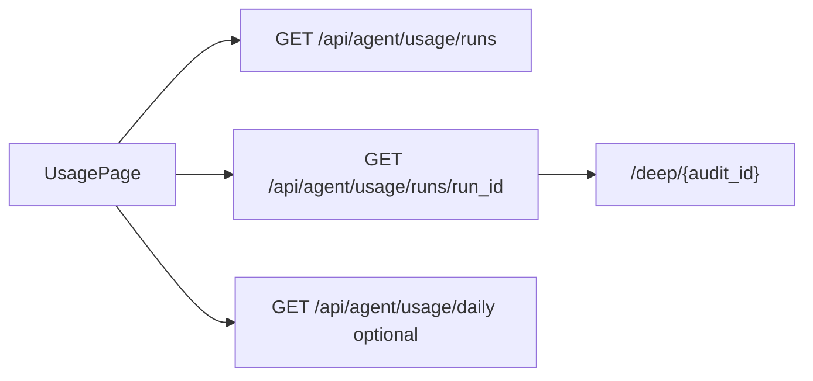

# FE Module 4 — Usage (`/usage`, `/usage/{run_id}`)

Расход токенов агентов — single read path через M14 runs API. Контракт — M17 §7.4; ADR memory.md.

**Зависит от:** [module-0-index.plan.md](./module-0-index.plan.md)

---

## Цель

Показать оператору историю agent runs с фильтрацией и drill-down в детали run (включая `step_breakdown` для deep), со ссылками на deep case по `audit_id`.

---

## Границы

**Входит:**

- `/usage` — таблица runs.
- `/usage/{run_id}` — detail view (sub-route или drawer — одно решение в task).
- `GET /api/agent/usage/runs` с filters + pagination.
- `GET /api/agent/usage/runs/{run_id}` — drill-down.
- Optional: `GET /api/agent/usage/daily` — summary widget.
- Query `?audit_id=` из deep chat link.
- Ссылки: `audit_id` → `/deep/{audit_id}`.

**Не входит:**

- `agent_sessions.usage_total` как primary total (запрещено ADR).
- Hypothesis daily budget ops UI (M12).
- Polling (pull-on-mount + manual refresh достаточно в R2).

---

## Промпт дизайна (UI)

```
Контекст: light-default ops dashboard, токены module-0 (semantic surfaces, JetBrains Mono для чисел).
Цель: прозрачность расхода токенов по runs — audit trail для ops.

Layout:
- Header: «Usage» + optional Daily summary cards (3 compact stat cards: total tokens today,
  deep cost, run count) from /daily if enabled.
- Filter bar: Gate | Agent kind (hypothesis/deep) | Date range | audit_id chip if from query.
- Main table: Time mono | Agent kind badge | Gate | Audit (link or «—») | Model | Tokens in/out
  mono right | Cost mono | Status badge.
- Detail (drawer 520px or /usage/:runId page): run metadata grid + step_breakdown table for deep
  (step name | tokens | duration); link «Open deep case» if audit_id.

Состояния:
- Loading skeleton.
- Empty: «Нет runs за период».
- Run без audit_id: em dash, no link; tooltip «backfill pending».
- Error: inline + Retry; mutations toast через `mapApiError` + `error_code`.

Компоненты: DataTable, Sheet, Badge, StatusBadge.
Typography: все числа JetBrains Mono tabular-nums.
Анимации: row hover only; drawer slide 250ms.
A11y: table caption; cost columns aria-label.
Out of scope: billing export, charts.
```

---

## Ключевые гарантии и инварианты

1. **Single read path:** только `GET /agent/usage/runs` (+ `/{run_id}`) — ADR 2026-06-17.
2. **Не использовать** `usage_total` session как главный total.
3. **Deep drill-down:** показать `step_breakdown` из run detail.
4. **audit_id link** → `/deep/{audit_id}` когда UUID present.
5. **Run без audit_id:** строка без ссылки (hypothesis до backfill — норма).
6. **Deep chat link** `?audit_id=` предзаполняет фильтр.
7. **Datetime** naive MSK as-is.

---

## Edge-cases

| Ситуация | Ожидаемое поведение |
|----------|---------------------|
| Run без audit_id | «—» в колонке; после refresh может появиться ссылка |
| Deep run drill-down | step_breakdown table visible |
| Empty runs for audit_id filter | «Нет runs для этого audit» |
| Invalid run_id 404 | Page error + back to /usage |
| Pagination | server-side envelope |

---

## Схема



---

## Флоу (клиент ↔ сервер)

1. Mount `/usage`: parse filters from URL (incl. audit_id from deep).
2. `GET /api/agent/usage/runs` → render table.
3. Optional: `GET /api/agent/usage/daily` → summary cards.
4. Row click → navigate `/usage/{run_id}` or open drawer → `GET .../{run_id}`.
5. Detail: metadata + step_breakdown; link to deep if audit_id.
6. Manual Refresh → refetch list.

---

## Структура

```
src/
├── pages/
│   ├── UsagePage.tsx
│   └── UsageRunDetailPage.tsx   # or drawer-only in UsagePage
├── components/
│   └── usage/
│       ├── UsageRunsTable.tsx
│       ├── UsageFilters.tsx
│       ├── UsageRunDetail.tsx
│       └── UsageDailySummary.tsx
├── api/
│   └── usage.ts
tests/
├── unit/usage/
└── e2e/usage.spec.ts
```

---

## Публичный API

| HTTP | Назначение | Owner |
|------|------------|-------|
| `GET /api/agent/usage/runs` | Main table | M14 |
| `GET /api/agent/usage/runs/{run_id}` | Drill-down | M14 |
| `GET /api/agent/usage/daily` | Optional summary | M14 |

OpenAPI tag: `agent-usage`. Тип: `AgentUsageRun`.

---

## Тесты

| Сценарий | Уровень | Критерий |
|----------|---------|----------|
| List from runs fixture | unit | Correct row count and columns |
| audit_id link | unit | Link href /deep/uuid when present |
| No link without audit_id | unit | No anchor when audit_id null |
| step_breakdown deep | unit | Steps rendered in detail |
| audit_id URL filter | unit | Query param sent to API |
| e2e drill-down | e2e | Click row → detail visible |

---

## DoD

- [ ] Таблица runs с filters и pagination.
- [ ] Drill-down с step_breakdown для deep.
- [ ] Links to deep by audit_id.
- [ ] Нет usage_total в коде страницы (lint/review).
- [ ] Light + dark корректны; semantic tokens, без hardcoded hex.
- [ ] Тесты проходят; M17 §9.2 usage пункты готовы.

---

## Зависимости

- module-0-index (layout, StatusBadge, ThemeProvider, api client, mapApiError)
- module-3-deep-chat (usage link inbound)
- M17 §7.4; M14 AgentUsageRun

---

## Артефакты

- Usage pages/components, `api/usage.ts`

---

## Владелец контракта

**Module-4 владеет:** UX `/usage` и read path M14.

**Ссылается на:** M17 §7.4; ADR usage single read path; M14 OpenAPI.
