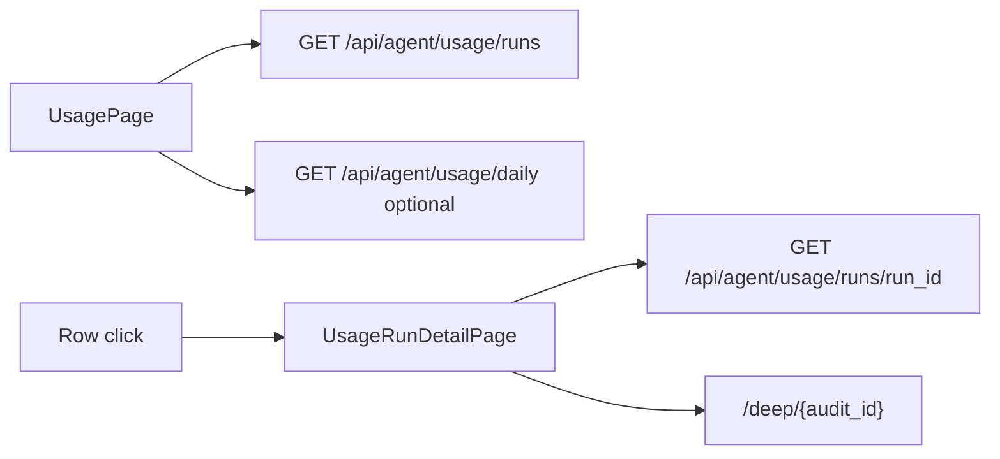

# FE Module 4 — Usage (`/usage`, `/usage/{run_id}`)

Расход токенов агентов — single read path через M14 runs API. Контракт — M17 §7.4; поля JSON — `docs/api.md` (M14); ADR `memory.md`.

**Зависит от:** [module-0-index.plan.md](./module-0-index.plan.md)

---

## Цель

Показать оператору историю agent runs с фильтрацией и drill-down в детали run (включая `step_breakdown` для deep), со ссылками на deep case по `audit_id`.

---

## Границы

**Входит:**

- `/usage` — таблица runs + optional daily summary.
- `/usage/{run_id}` — detail sub-route (не drawer).
- `GET /api/agent/usage/runs` с filters + pagination.
- `GET /api/agent/usage/runs/{run_id}` — drill-down.
- Optional: `GET /api/agent/usage/daily` — summary cards (deep only).
- Query `?audit_id=` из deep chat link (M3).
- Ссылки: `audit_id` → `/deep/{audit_id}`.

**Не входит:**

- `agent_sessions.usage_total` как primary total (запрещено ADR).
- Hypothesis daily budget ops UI (M12).
- Budget enforcement UX (`409 budget_exceeded`) — M3 deep chat.
- Polling (pull-on-mount + manual refresh достаточно в R2).

---

## Промпт дизайна (UI)

```
Контекст: light-default ops dashboard, токены module-0 (semantic surfaces, JetBrains Mono для чисел).
Цель: прозрачность расхода токенов по runs — audit trail для ops.

Layout:
- Header: «Usage» + optional Daily summary cards (3 compact stat cards: total tokens today,
  deep cost USD, run count) — client-side sum из GET /agent/usage/daily.
- Filter bar: Gate | Agent kind (hypothesis/deep) | Date range | audit_id chip if from query.
- Main table: Time mono | Agent kind badge | Gate | Audit (link or «—») | Model |
  prompt/completion tokens mono right | Cost (estimated_cost_usd) mono | Status badge.
- Detail page /usage/:runId: metadata grid (run_id, agent_kind, gate_id, audit_id, model,
  prompt_tokens, completion_tokens, total_tokens, estimated_cost_usd, latency_ms, status, error,
  session_id, provider_run_id, created_at) + step_breakdown table for deep runs only
  (tool_name | latency_ms); link «Open deep case» if audit_id.

Состояния:
- Loading skeleton.
- Empty: «Нет runs за период».
- Run без audit_id: em dash, no link; tooltip «backfill pending».
- Invalid run_id 404: inline error + link back to /usage.
- Error list: inline + Retry; mapApiError + error_code.

Компоненты: DataTable, Badge, StatusBadge.
Typography: все числа JetBrains Mono tabular-nums.
Анимации: row hover only.
A11y: table caption; cost columns aria-label.
Out of scope: billing export, charts; tokens per step (нет в API step_breakdown).
```

---

## Маппинг полей (OpenAPI M14)

Source of truth: `docs/api.md` § Agent — usage (M14). Не дублировать в Zod устаревшие имена fixture M0.

| UI | Поле API |
|----|----------|
| Tokens in | `prompt_tokens` (`integer \| null`) |
| Tokens out | `completion_tokens` (`integer \| null`) |
| Total tokens (detail) | `total_tokens` |
| Cost | `estimated_cost_usd` |
| Status | `success` \| `error` \| `skipped` |
| Gate | `gate_id` (`string \| null`) |
| Step row | `step_breakdown[]`: `{ tool_name, latency_ms }` — **без tokens per step** |

`AgentUsageDailyRollup`: `{ date, gate_id, agent_kind: "deep", total_tokens, total_cost_usd, run_count }`.

Daily widget: query `date_from` / `date_to` = сегодня (MSK calendar date as-is); optional `gate_id` из фильтра; **sum** `total_tokens`, `total_cost_usd`, `run_count` по всем items ответа.

---

## Ключевые гарантии и инварианты

1. **Single read path:** только `GET /agent/usage/runs` (+ `/{run_id}`, optional `/daily`) — ADR 2026-06-17.
2. **Не использовать** `usage_total` session как главный total.
3. **Deep drill-down:** `step_breakdown` — только `tool_name` + `latency_ms`.
4. **audit_id link** → `/deep/{audit_id}` когда UUID present.
5. **Run без audit_id:** строка без ссылки (hypothesis до backfill — норма).
6. **Deep chat link** `?audit_id=` предзаполняет фильтр.
7. **Datetime** naive MSK as-is.
8. **Fixture M0:** `src/api/fixtures/agentUsageRun.ts` привести к OpenAPI M14 в задаче `m4-api-usage`.

---

## Edge-cases

| Ситуация | Ожидаемое поведение |
|----------|---------------------|
| Run без audit_id | «—» в колонке; после refresh может появиться ссылка |
| Deep run drill-down | step_breakdown table: tool_name, latency_ms |
| Hypothesis run detail | metadata grid; step_breakdown скрыта или empty state |
| Empty runs for audit_id filter | «Нет runs для этого audit» |
| Invalid run_id 404 | `usage_run_not_found` + back to /usage |
| Pagination | server-side envelope `{ items, total, page, page_size }` |
| null token fields | em dash в UI |

---

## Схема



---

## Флоу (клиент ↔ сервер)

1. Mount `/usage`: parse filters from URL (incl. `audit_id` from deep).
2. `GET /api/agent/usage/runs` → render table.
3. Optional: `GET /api/agent/usage/daily?date_from=&date_to=` (today) → sum → summary cards.
4. Row click → `/usage/{run_id}` → `GET .../{run_id}`.
5. Detail: metadata + step_breakdown (deep); link to deep if audit_id.
6. Manual Refresh → refetch list.

---

## Структура

```
src/
├── pages/
│   ├── UsagePage.tsx
│   └── UsageRunDetailPage.tsx
├── components/
│   └── usage/
│       ├── UsageRunsTable.tsx
│       ├── UsageFilters.tsx
│       ├── UsageRunDetail.tsx
│       └── UsageDailySummary.tsx
├── api/
│   └── usage.ts
tests/
├── unit/usage/
└── e2e/usage.spec.ts
```

---

## Публичный API

| HTTP | Назначение | Owner |
|------|------------|-------|
| `GET /api/agent/usage/runs` | Main table | M14 |
| `GET /api/agent/usage/runs/{run_id}` | Drill-down | M14 |
| `GET /api/agent/usage/daily` | Optional summary (deep rollups) | M14 |

OpenAPI tag: `agent-usage`. Типы: `AgentUsageRun`, `UsageRunListPage`, `AgentUsageDailyRollup[]`.

List query: `gate_id`, `agent_kind`, `audit_id`, `from`, `to`, `page`, `page_size`.  
Daily query: `gate_id?`, `date_from?`, `date_to?`.

---

## Тесты

| Сценарий | Уровень | Критерий |
|----------|---------|----------|
| List from runs fixture | unit | Row count; OpenAPI field names in columns |
| audit_id link | unit | Link href `/deep/uuid` when present |
| No link without audit_id | unit | No anchor when audit_id null |
| step_breakdown deep | unit | tool_name + latency_ms rendered |
| audit_id URL filter | unit | Query param sent to API |
| daily sum | unit | Cards sum rollup items for today |
| e2e drill-down | e2e | Click row → `/usage/:runId` detail visible |

---

## DoD

- [ ] `api/usage.ts` + fixture M14-aligned.
- [ ] Таблица runs с filters и pagination.
- [ ] Sub-route `/usage/:runId` с step_breakdown для deep.
- [ ] Links to deep by audit_id.
- [ ] Нет `usage_total` в коде модуля.
- [ ] Light + dark корректны; semantic tokens.
- [ ] Тесты проходят; M17 §9.2 usage пункты готовы.

---

## Зависимости

- module-0-index (layout, StatusBadge, api client, mapApiError) — completed
- module-3-deep-chat inbound link `/usage?audit_id=` — done
- M17 §7.4; M14 OpenAPI (`docs/api.md`)

---

## Артефакты

- Usage pages/components, `api/usage.ts`, synced `agentUsageRun` fixture

---

## Владелец контракта

**Module-4 владеет:** UX `/usage`, `/usage/{run_id}` и read path M14.

**Ссылается на:** M17 §7.4; ADR usage single read path; `docs/api.md` M14.
