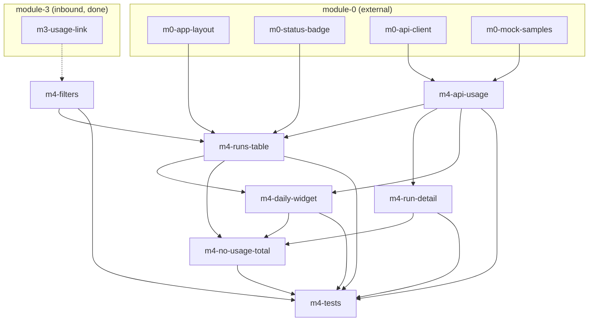

# Task-пакет: module-4-usage

Родительский план: [module-4-usage.plan.md](../module-4-usage.plan.md)

**Внешние зависимости (module-0, completed):** `m0-app-layout`, `m0-status-badge`, `m0-api-client`, `m0-mock-samples`.

**Upstream (module-3, inbound):** `m3-usage-link` — `/usage?audit_id=` из DeepChatPage (done).

## Задачи

| id | Содержание | depends_on | Статус |
|----|------------|------------|--------|
| m4-api-usage | api/usage.ts + fixture M14 | m0-api-client, m0-mock-samples | completed |
| m4-filters | UsageFilters + URL sync | — | completed |
| m4-runs-table | UsagePage + table + pagination | m4-api-usage, m4-filters | completed |
| m4-run-detail | Route /usage/:runId + detail | m4-api-usage | completed |
| m4-daily-widget | Daily summary cards (sum rollups) | m4-api-usage, m4-runs-table | completed |
| m4-no-usage-total | Guard no usage_total | m4-runs-table, m4-run-detail, m4-daily-widget | completed |
| m4-tests | Vitest + e2e | все m4-* выше | completed |

## Граф зависимостей

## Параллельность

**Волна 1** (параллельно):
- `m4-api-usage`
- `m4-filters`

**Волна 2** (после api):
- `m4-runs-table` (нужны api + filters)
- `m4-run-detail` (только api; параллельно с runs-table — разные файлы)

**Волна 3:**
- `m4-daily-widget` (после UsagePage shell)

**Волна 4:**
- `m4-no-usage-total`

**Финал:**
- `m4-tests`

## Рекомендуемый порядок (последовательный)

1. m4-api-usage ∥ m4-filters  
2. m4-runs-table ∥ m4-run-detail  
3. m4-daily-widget  
4. m4-no-usage-total  
5. m4-tests  
