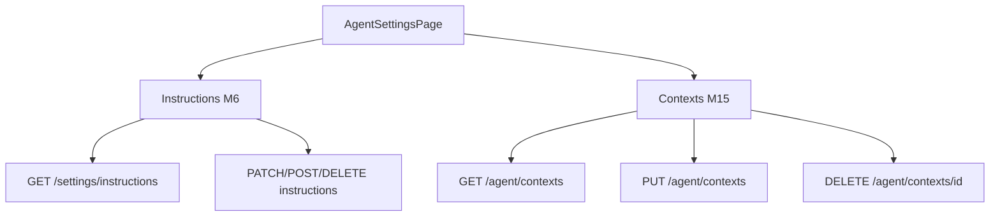

# FE Module 5 — Agent Settings (`/settings/agents`)

Управление agent instructions (M6) и contexts (M15). Контракт — M17 §7.5.

**Зависит от:** [module-0-index.plan.md](./module-0-index.plan.md)

---

## Цель

Дать оператору UI для CRUD agent instructions и upsert/delete agent contexts (global и per-gate), разделённых по `agent_kind` (hypothesis / deep).

---

## Границы

**Входит:**

- Страница `/settings/agents` (исправить route из `/settings` если нужно).
- **Instructions (M6):** list, toggle enabled, edit `prompt_template`, create, delete.
- **Contexts (M15):** list filtered by `agent_kind` + `gate_id`; upsert global/per-gate; delete.
- **Detector (M2):** read-only просмотр detector config (вкладка Detector).
- Error handling 409 с `error_code`.
- Pull-on-mount + manual save (no polling).

**Не входит:**

- Редактирование detector config на сервере (только read-only UI).
- Agent preview debug route.
- RBAC / per-user permissions.

---

## Промпт дизайна (UI)

```
Контекст: light-default ops dashboard, токены module-0; settings — формы и таблицы, lower visual noise than monitoring.
Цель: конфигурация prompts и контекстов агентов без случайных изменений.

Layout:
- Page header: «Agent Settings».
- Tabs (underline style): Instructions | Contexts | Detector.
- Tab Instructions:
  - Toolbar: + New instruction.
  - Table: Name | agent_kind (if in API) | Enabled switch | Updated | Actions (Edit, Delete).
  - Editor panel (slide-over or inline expand): prompt_template monospace textarea (min-h 240px),
    Save / Cancel; destructive Delete with confirm dialog.
- Tab Contexts:
  - Sub-filter row: Agent kind select (hypothesis/deep) | Gate select (+ «Global» option).
  - List cards: context key, preview truncated, scope badge Global/Per-gate.
  - Editor: agent_kind, gate_id nullable, content textarea, Save (PUT upsert), Delete.

Состояния:
- Loading lists skeleton.
- Empty instructions: «Нет instructions» + CTA create.
- Save in progress: button spinner disabled.
- 409 conflict: toast `mapApiError` + error_code, form not cleared.
- Delete confirm modal.

Компоненты: Tabs, Switch, Textarea, Dialog, DataTable, Select.
Анимации: tab indicator slide 200ms; no optimistic row removal.
A11y: switch aria-label; textarea label; confirm dialog focus trap.
Out of scope: version history, diff view.
```

---

## Ключевые гарантии и инварианты

1. **Две секции:** Instructions (M6) и Contexts (M15) — не смешивать API paths.
2. **Contexts по agent_kind:** hypothesis / deep — отдельные фильтры/формы.
3. **Upsert global:** `gate_id` null; per-gate — explicit gate_id.
4. **Mutations не optimistic** — ждать ответ; ошибка → toast + preserved form.
5. **409 conflict:** показать `error_code` из envelope.
6. **Instructions list R2:** одна секция prompts если M6 без agent_kind filter (M17 §7.5).

---

## Edge-cases

| Ситуация | Ожидаемое поведение |
|----------|---------------------|
| PATCH toggle fail | Revert switch visual after error toast |
| PUT context 409 | Toast error_code; editor open |
| DELETE instruction 404 | Toast; refetch list |
| Empty contexts for gate | Empty state + create |
| Long prompt_template | Textarea scroll; monospace |

---

## Схема



---

## Флоу (клиент ↔ сервер)

**Instructions:**

1. `GET /api/settings/instructions` → table.
2. Toggle enabled → `PATCH /api/settings/instructions/{id}`.
3. Edit → load → `PATCH` partial `AgentInstructionPatch`.
4. Create → `POST`; Delete → `DELETE` + confirm.

**Contexts:**

1. `GET /api/agent/contexts?agent_kind=&gate_id=` → list.
2. Edit/create → `PUT /api/agent/contexts` upsert.
3. Delete → `DELETE /api/agent/contexts/{context_id}`.

---

## Структура

```
src/
├── pages/
│   └── AgentSettingsPage.tsx
├── components/
│   └── settings/
│       ├── InstructionsTab.tsx
│       ├── InstructionEditor.tsx
│       ├── ContextsTab.tsx
│       └── ContextEditor.tsx
├── api/
│   ├── instructions.ts
│   └── contexts.ts
tests/
└── unit/settings/
```

---

## Публичный API

| HTTP | Назначение | Owner |
|------|------------|-------|
| `GET/POST/PATCH/DELETE /api/settings/instructions*` | Instructions CRUD | M6 |
| `GET/PUT/DELETE /api/agent/contexts*` | Contexts | M15 |

OpenAPI tags: `instruction_store`, `agent_context_store`.

---

## Тесты

| Сценарий | Уровень | Критерий |
|----------|---------|----------|
| Instructions list render | unit | Rows from fixture |
| Toggle enabled PATCH | unit | Mock PATCH called; switch state |
| Context PUT roundtrip | unit | Upsert payload matches form |
| 409 toast | unit | error_code shown |
| Delete confirm | unit | DELETE only after confirm |

---

## DoD

- [x] Tabs Instructions + Contexts + Detector на `/settings/agents`.
- [x] CRUD instructions и upsert/delete contexts работают на mock.
- [x] 409 и другие ошибки с error_code.
- [x] Light + dark корректны (module-0).
- [x] Тесты проходят; M17 §9.2 settings пункты готовы.
- [x] `docs/modules/module-5-agent-settings.md`.

---

## Зависимости

- module-0-index (layout, api client, mapApiError, toast, no optimistic mutations)
- M17 §7.5; M6 AgentInstruction; M15 AgentContext

---

## Артефакты

- AgentSettingsPage, settings/* components, api/instructions.ts, api/contexts.ts

---

## Владелец контракта

**Module-5 владеет:** UX `/settings/agents`.

**Ссылается на:** M17 §7.5; M6/M15 OpenAPI.
