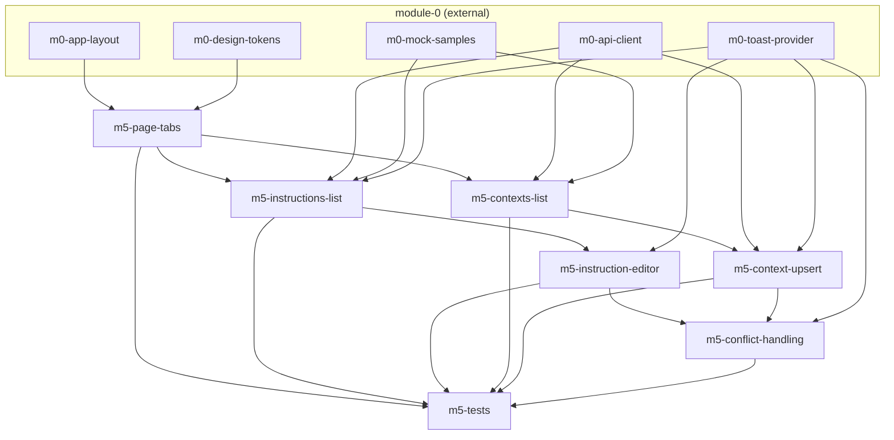

# Task-пакет: module-5-agent-settings

Родительский план: [module-5-agent-settings.plan.md](../module-5-agent-settings.plan.md)

**Внешние зависимости (module-0, completed):** `m0-app-layout`, `m0-design-tokens`, `m0-api-client`, `m0-mock-samples`, `m0-toast-provider`.

## Задачи

| id | Содержание | depends_on | Статус |
|----|------------|------------|--------|
| m5-page-tabs | AgentSettingsPage tabs Instructions \| Contexts | m0-app-layout, m0-design-tokens | pending |
| m5-instructions-list | GET instructions + toggle PATCH | m5-page-tabs, m0-api-client, m0-mock-samples, m0-toast-provider | pending |
| m5-instruction-editor | Create/edit/delete prompt_template | m5-instructions-list, m0-toast-provider | pending |
| m5-contexts-list | GET contexts filter agent_kind + gate | m5-page-tabs, m0-api-client, m0-mock-samples | pending |
| m5-context-upsert | PUT upsert + DELETE context | m5-contexts-list, m0-api-client, m0-toast-provider | pending |
| m5-conflict-handling | 409 → toast error_code; form preserved | m5-instruction-editor, m5-context-upsert, m0-toast-provider | pending |
| m5-tests | Vitest settings module | все m5-* выше | pending |

## Граф зависимостей

## Параллельность

**Волна 1:**
- `m5-page-tabs`

**Волна 2** (параллельно — разные tab-компоненты):
- `m5-instructions-list` ∥ `m5-contexts-list`

**Волна 3** (параллельно — разные editors):
- `m5-instruction-editor` ∥ `m5-context-upsert`

**Волна 4:**
- `m5-conflict-handling`

**Финал:**
- `m5-tests`

## Рекомендуемый порядок (последовательный)

1. m5-page-tabs  
2. m5-instructions-list ∥ m5-contexts-list  
3. m5-instruction-editor ∥ m5-context-upsert  
4. m5-conflict-handling  
5. m5-tests  
