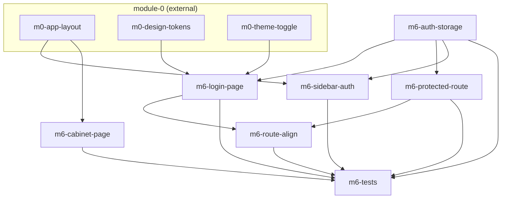

# Task-пакет: module-6-mock-auth

Родительский план: [module-6-mock-auth.plan.md](../module-6-mock-auth.plan.md)

**Внешние зависимости (module-0, completed):** `m0-app-layout`, `m0-design-tokens`, `m0-theme-toggle`.

## Задачи

| id | Содержание | depends_on | Статус |
|----|------------|------------|--------|
| m6-auth-storage | mockSession localStorage + MOCK_AUTH_ENABLED | — | pending |
| m6-login-page | LoginPage form → session → /monitoring | m6-auth-storage, m0-design-tokens, m0-theme-toggle | pending |
| m6-protected-route | ProtectedRoute guard wrapper | m6-auth-storage | pending |
| m6-sidebar-auth | Sidebar Login/Logout slot | m6-auth-storage, m0-app-layout | pending |
| m6-cabinet-page | CabinetPage placeholder «скоро» | m0-app-layout | pending |
| m6-route-align | Wrap protected paths in routes | m6-protected-route, m6-login-page | pending |
| m6-tests | Vitest + e2e auth | все m6-* выше | pending |

## Граф зависимостей

## Параллельность

**Волна 1:**
- `m6-auth-storage` ∥ `m6-cabinet-page` (cabinet не зависит от storage)

**Волна 2** (параллельно — разные файлы):
- `m6-login-page` ∥ `m6-protected-route` ∥ `m6-sidebar-auth`

**Волна 3:**
- `m6-route-align`

**Финал:**
- `m6-tests`

## Рекомендуемый порядок (последовательный)

1. m6-auth-storage ∥ m6-cabinet-page  
2. m6-login-page ∥ m6-protected-route ∥ m6-sidebar-auth  
3. m6-route-align  
4. m6-tests  

**Примечание:** module-6 может идти параллельно с module-1+ после index; желательно рано для e2e остальных страниц.
