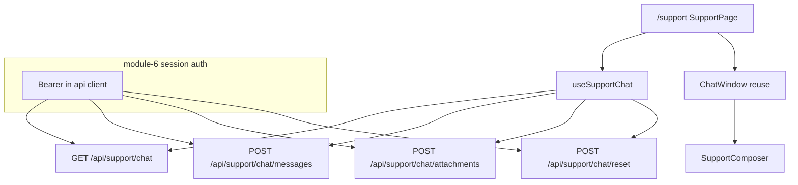
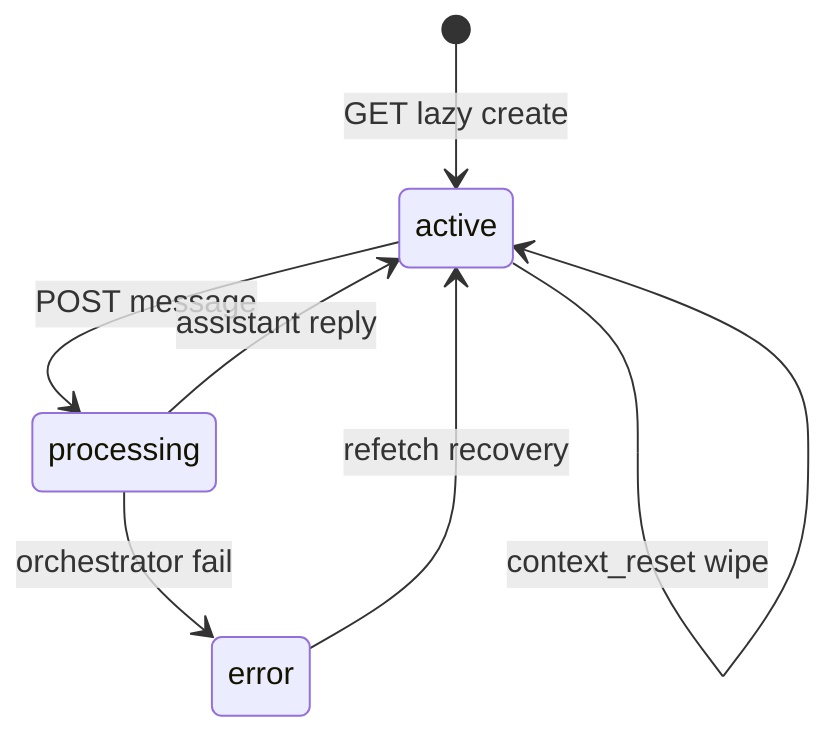

# FE Module 7 — Support (`/support`)

План per-page для **monitor_frontend**. Контракт полей — [`docs/api.md`](docs/api.md) § Support chat (M18); transport — M18 § «Observability & SPA transport» (аналог deep chat M3). **Auth** — [module-6-mock-auth](.cursor/plans/FE/module-6-mock-auth.plan.md) (Bearer M19).

**Текущее состояние:** реализован [`src/pages/SupportPage.tsx`](src/pages/SupportPage.tsx) с `useSupportChat`, вложениями, reset и banners; unit-тесты — [`tests/unit/support/`](tests/unit/support/).

**Зависит от:** [module-0-index.plan.md](.cursor/plans/FE/module-0-index.plan.md) (completed), [module-6-mock-auth](.cursor/plans/FE/module-6-mock-auth.plan.md) (Bearer), backend M18 wire.

---

## Цель

Дать оператору user-centric support-чат: текст + файлы, auto-execute MCP (без approve), polling пока агент обрабатывает, явный reset и уведомление о ротации истории.

---

## Границы

**Входит:**

- Замена placeholder на полноценную страницу `/support`.
- `GET /api/support/chat` — mount + polling при `state=processing`.
- `POST /api/support/chat/messages` — текст и/или `attachment_ids`.
- `POST /api/support/chat/attachments` — multipart upload (`Content-Type` не JSON — исключение на границе `api/support.ts`).
- `POST /api/support/chat/reset` — явный сброс истории.
- `useSupportChat` — polling, мутации, stop on unmount.
- `api/support.ts` + Zod-парсинг `SupportChatSnapshot` на границе API.
- Fixture `SupportChatSnapshot` для Vitest/fixture mode.
- Переиспользование LLM-layout из deep: [`ChatWindow`](src/components/deep/ChatWindow.tsx), [`ChatMessageList`](src/components/deep/ChatMessageList.tsx), [`ChatMessage`](src/components/deep/ChatMessage.tsx) — с расширением под вложения.
- Banner при `context_reset=true` («История очищена (лимит)»).
- Header: статус чата (`StatusBadge`), link «Расход токенов» → `/usage?agent_kind=support`, кнопка «Сбросить чат».
- Минимальная delta usage: `agent_kind=support` в URL-фильтрах (M14 literal; сейчас FE Zod/filter — только `hypothesis` | `deep`).
- Обработка `409 chat_processing`, `422 attachment_rejected`, `404 attachment_not_found` через toast + `error_code`.

**Не входит:**

- Реализация auth (login/logout/Bearer) — **module-6-mock-auth**.
- Approve/Reject tool actions (M18 auto-execute).
- WebSocket/SSE, streaming tokens.
- Отображение `usage_total` из snapshot как primary total (ADR memory.md — `/usage` runs).
- Редактирование M15 contexts (module-5 settings).
- Скачивание attachment binary (нет GET endpoint — только имена из upload response / pending chips).
- Optimistic UI для messages.
- Расширение `StatusBadge` новым вариантом `processing` — маппинг на существующие варианты (см. UX).

---

## Промпт дизайна (UI)

```
Контекст: light-default ops dashboard (module-0); тот же LLM chat layout что M3 deep, без audit meta и approval.
Цель: операторский support-чат с файлами — знакомый ChatGPT-паттерн.

Layout /support:
- Header одна строка: «Саппорт» | StatusBadge | link «Расход токенов» | outline «Сбросить чат».
- ContextResetBanner: amber border, dismissible, под header.
- ChatWindow full-height: scroll messages + sticky composer.
- Composer: pill как deep ChatComposer; кнопка 📎 активна; disabled целиком при processing.

StatusBadge маппинг (без нового variant):
- active → «Активен»
- processing → active + label «Обработка…»
- error → «Ошибка»

Сообщения: user справа, assistant слева, system compact mono.
Вложения: chips под текстом bubble / в composer до send.

Компоненты: ChatWindow (deep), Button, Textarea, sonner toast, AlertDialog для reset.
Анимации: new message fade-in 200ms; reduced-motion — instant.
A11y: messages aria-live polite; attach aria-label; reset confirm dialog.
Out of scope: markdown editor, voice, sidebar case panel.
```

---

## Концепция страницы (UX)

Стандартный LLM-layout как M3 — один вертикальный столбец, composer внизу. **Без** ApprovalBar, **без** audit meta strip, **без** CTA «Открыть анализ» (lazy create на первом `GET`).

| `state` | UI |
|---------|-----|
| `active` | Composer enabled; polling **остановлен** |
| `processing` | Composer disabled; StatusBadge «Обработка…»; polling **1–2 с** |
| `error` | Banner/toast; composer enabled только если snapshot вернулся в `active` |

---

## Ключевые гарантии и инварианты

1. **Bearer обязателен** — support-вызовы через `api/client` с токеном module-6-mock-auth; `401 not_authenticated` → redirect `/login` (auth-слой; support только потребляет).
2. **Polling только при `processing`** — интервал **1–2 с** (M18 § Observability & SPA transport); `active` / `error` — stop; unmount — `clearInterval` ([`usePolling`](src/hooks/usePolling.ts)).
3. **После любого POST** (message, attachment, reset) — немедленный `GET /api/support/chat`, затем interval по новому `state`.
4. **`state=processing`** — composer и attach disabled; `409 chat_processing` на message → refetch + toast, draft сохранён.
5. **Сообщение:** хотя бы непустой `content` или непустой `attachment_ids` (API validation).
6. **Вложения:** upload → pending chips → `attachment_ids` в POST message; чужой id → 404 toast.
7. **`context_reset=true`** — dismissible banner; не блокирует ввод.
8. **Datetime MSK** — отображать как приходит, без TZ-конвертации (memory.md).
9. **`usage_total` в snapshot** — не показывать как главный итог; только link на `/usage?agent_kind=support`.
10. **Секреты MCP** — не рендерить в bubbles.

---

## Edge-cases

| Ситуация | Ожидаемое поведение |
|----------|---------------------|
| Mount `/support` без prior chat | `GET` lazy-create → пустой чат |
| POST message при `processing` | 409 `chat_processing` → refetch; draft сохранён |
| Upload / attach при `processing` | UI disabled; при ошибке API — toast + refetch |
| Пустое сообщение без вложений | Client-side guard + 422 от API |
| Upload oversized / bad mime | 422 `attachment_rejected` → toast |
| Auto rotation history (лимит) | `context_reset=true` + новые messages → banner |
| Explicit reset | POST reset → пустая история + banner |
| `state=error` в snapshot | Error banner; refetch; composer по итоговому `state` |
| `role=system` в messages | Compact mono block (как deep) |
| Уход со страницы | Stop polling |
| Tab hidden | Interval ×2 ([`usePolling`](src/hooks/usePolling.ts)) |
| Fixture mode без API | `SupportChatSnapshot` fixture + mock `api/support` (паттерн module-1/2) |
| 401 на GET | Auth layer → `/login` (module-6-mock-auth) |
| Deep-link `/usage?agent_kind=support` | Фильтр применяет `support` после todo `m7-usage-filter-support` |

---

## Схема





---

## Флоу (клиент ↔ сервер)

1. Navigate `/support` (после module-6-mock-auth session).
2. `GET /api/support/chat` → `SupportChatSnapshot` (lazy create).
3. Polling **только** если `state=processing`.
4. Upload: user picks file → `POST .../attachments` → pending chip с `filename`.
5. Send: `POST .../messages` → immediate GET → poll while `processing`.
6. Auto rotation: сервер wipe + `context_reset=true` → banner после refetch.
7. Reset: confirm dialog → `POST .../reset` → GET → empty history + banner.
8. Unmount → stop polling.

---

## Структура файлов

```
src/
├── pages/
│   └── SupportPage.tsx
├── components/
│   └── support/
│       ├── SupportHeader.tsx
│       ├── SupportComposer.tsx
│       ├── AttachmentChips.tsx
│       ├── ContextResetBanner.tsx
│       └── index.ts
├── hooks/
│   └── useSupportChat.ts
├── api/
│   ├── support.ts
│   └── fixtures/
│       └── supportChatSnapshot.ts
tests/
├── unit/support/
│   ├── useSupportChat.test.ts
│   ├── SupportPage.test.tsx
│   └── SupportComposer.test.tsx
└── e2e/support.spec.ts
```

**Переиспользование (read-only):** `components/deep/ChatWindow`, `ChatMessageList`, `ChatMessage`.

**Delta usage (todo `m7-usage-filter-support`):** `src/lib/usageFilters.ts`, `src/components/usage/UsageFilters.tsx`, `src/api/fixtures/agentUsageRun.ts` — literal `support` в `agent_kind`.

---

## Публичный API

| HTTP | Назначение | Потребитель | Owner |
|------|------------|-------------|-------|
| `GET /api/support/chat` | Polling snapshot | `useSupportChat` | M18 |
| `POST /api/support/chat/messages` | User message | `SupportComposer` | M18 |
| `POST /api/support/chat/attachments` | Upload file | `SupportComposer` | M18 |
| `POST /api/support/chat/reset` | Reset history | `SupportHeader` | M18 |

Тип ответа: `SupportChatSnapshot` — поля см. [`docs/api.md`](docs/api.md). OpenAPI — source of truth для JSON; M18 — когда вызывать.

**Публичный FE API модуля:**

| Экспорт | Потребитель |
|---------|-------------|
| `SupportPage` | `routes.tsx` |
| `useSupportChat` | `SupportPage` |
| `api/support.ts` функции чата | `useSupportChat` |

---

## Тесты

| Сценарий | Уровень | Критерий |
|----------|---------|----------|
| LLM layout | unit | Composer внизу; messages flex-1 |
| Mount GET snapshot | unit | `useSupportChat` вызывает GET на mount |
| processing polling | unit | `state=processing` → interval active; `active` → stop |
| processing blocks input | unit | textarea disabled при `processing` |
| 409 chat_processing | unit | POST fail → refetch; draft не очищен |
| send with attachment | unit | upload → POST message с `attachment_ids` |
| context_reset banner | unit | `context_reset=true` → banner visible |
| reset flow | unit | POST reset → messages empty |
| unmount stop | unit | clearInterval on unmount |
| usage link + filter | unit | Link с `agent_kind=support`; filter принимает literal |
| e2e send message | e2e | auth fixture (module-6-mock-auth) → /support → send → assistant visible |

---

## DoD

- [x] Placeholder «Саппорт — скоро» заменён на рабочий чат.
- [x] Все 4 support endpoints интегрированы (или fixtures в fixture mode).
- [x] Polling 1–2 с только при `processing`; stop on unmount.
- [x] Вложения: upload + отправка с message.
- [x] Reset + `context_reset` banner.
- [x] `usage_total` не используется как primary UI total.
- [x] Deep-link `/usage?agent_kind=support` работает (filter literal `support`).
- [x] Тесты из таблицы проходят; `SupportPage.test` в `tests/unit/support/`.
- [x] `docs/modules/module-7-support.md`.

---

## Зависимости

| Модуль | Статус | Зачем |
|--------|--------|-------|
| [module-0-index](.cursor/plans/FE/module-0-index.plan.md) | completed | `usePolling`, `api/client`, toast, layout |
| [module-6-mock-auth](.cursor/plans/FE/module-6-mock-auth.plan.md) | completed | Bearer M19 на API |
| Backend M18 | in progress | `/api/support/chat/*` wire |
| [module-3-deep-chat](.cursor/plans/FE/module-3-deep-chat.plan.md) | completed | `useDeepChat`, ChatWindow |
| [module-4-usage](.cursor/plans/FE/module-4-usage.plan.md) | completed | Usage page; delta `agent_kind=support` |
| M14 / M18 | backend | literal `support` в `AgentUsageRun` |
| [module-18-support-agent.plan.md](.cursor/plans/R2/module-18-support-agent.plan.md) | draft | Backend контракт |

**Порядок todos:** `m7-api-support` + `m7-fixture-support` → `m7-use-support-chat` → UI tasks (`m7-page-shell`, `m7-composer-*`, `m7-header`, banners) параллельно → `m7-usage-filter-support` → `m7-tests`.

---

## Артефакты

- `SupportPage.tsx`, `components/support/*`, `useSupportChat.ts`, `api/support.ts`
- Fixture `supportChatSnapshot.ts`
- Delta usage filters (`support` literal)
- `tests/unit/support/*`, `tests/e2e/support.spec.ts`
- `docs/modules/module-7-support.md` (после закрытия)

---

## Владелец контракта

**Module-7-support владеет:** UX `/support`, `useSupportChat`, support components, `api/support.ts`, delta usage filter для deep-link.

**Ссылается на:** M18 `SupportChatSnapshot`; M18 § SPA transport; module-6 session auth; OpenAPI — поля JSON.

**Не владеет:** auth session, backend `AgentKind`, M15 contexts CRUD.
