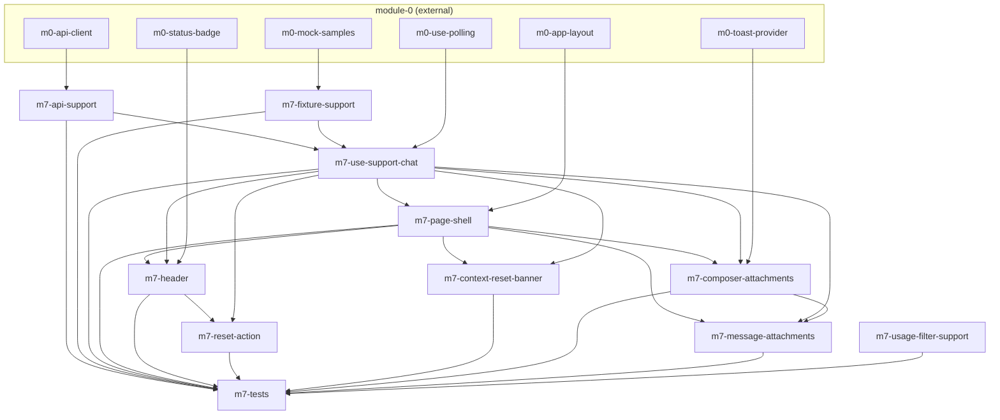

# Task-пакет: module-7-support

Родительский план: [module-7-support.plan.md](../module-7-support.plan.md)

**Внешние зависимости (module-0, completed):** `m0-api-client`, `m0-use-polling`, `m0-app-layout`, `m0-status-badge`, `m0-toast-provider`, `m0-mock-samples`.

**Внешний блокер:** **module-7-auth** (Bearer в `api/client`) — support endpoints требуют auth; до готовности — fixture mode + unit tests.

## Задачи

| id | Содержание | depends_on | Статус |
|----|------------|------------|--------|
| m7-api-support | api/support.ts + Zod | m0-api-client | pending |
| m7-fixture-support | supportChatSnapshot fixture | m0-mock-samples | pending |
| m7-use-support-chat | useSupportChat hook | m7-api-support, m7-fixture-support, m0-use-polling | pending |
| m7-page-shell | SupportPage shell + ChatWindow | m7-use-support-chat, m0-app-layout | pending |
| m7-header | SupportHeader status + usage link | m7-page-shell, m7-use-support-chat, m0-status-badge | pending |
| m7-reset-action | Reset confirm + POST | m7-header, m7-use-support-chat | pending |
| m7-context-reset-banner | ContextResetBanner | m7-page-shell, m7-use-support-chat | pending |
| m7-composer-attachments | SupportComposer + upload | m7-page-shell, m7-use-support-chat, m0-toast-provider | pending |
| m7-message-attachments | Attachments in bubbles | m7-page-shell, m7-use-support-chat, m7-composer-attachments | pending |
| m7-usage-filter-support | agent_kind=support in usage | — | pending |
| m7-tests | Vitest + e2e | все m7-* выше | pending |

## Граф зависимостей

## Параллельность

**Волна 1** (параллельно):
- `m7-api-support`
- `m7-fixture-support`
- `m7-usage-filter-support` (независим от support chat wire)

**Волна 2:**
- `m7-use-support-chat`

**Волна 3:**
- `m7-page-shell`

**Волна 4** (параллельно — разные файлы, кроме общего `SupportPage.tsx`):
- `m7-header` ∥ `m7-context-reset-banner` ∥ `m7-composer-attachments`

Рекомендуется **последовательно** править `SupportPage.tsx`: banner → header → composer → message-attachments.

**Волна 5:**
- `m7-reset-action` (после `m7-header`)
- `m7-message-attachments` (после `m7-composer-attachments`)

**Финал:**
- `m7-tests`

## Рекомендуемый порядок (последовательный)

1. m7-api-support ∥ m7-fixture-support ∥ m7-usage-filter-support  
2. m7-use-support-chat  
3. m7-page-shell  
4. m7-context-reset-banner  
5. m7-header  
6. m7-composer-attachments  
7. m7-message-attachments  
8. m7-reset-action  
9. m7-tests  
