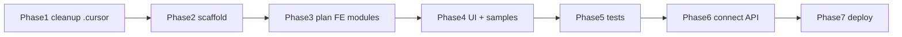

## Контекст

Репозиторий `monitor_frontend` пока содержит только `.cursor` (перенесён из backend), `.git`, пустой `.gitignore`. Цель — фронтенд для **BB Anomaly Detection R2**: React SPA, потребитель REST `anomaly-api`.

Source of truth контракта — [.cursor/plans/R2/module-17-web-frontend-contract.plan.md](.cursor/plans/R2/module-17-web-frontend-contract.plan.md): стек React 19 + Vite + TS + Tailwind + shadcn/ui + React Router v7; 6 страниц + 2 mock; HTTP polling; `ANOMALY_API_BASE_URL` с `/api`; dark mode data-dense dashboard.

Решения пользователя: **адаптировать** backend-обвязку (не удалять/не игнорировать), план фронта в **`.cursor/plans/FE/`**.

---

## Phase 1 — Адаптация `.cursor` (немедленный шаг)

### Переписать
- [.cursor/rules/development.mdc](.cursor/rules/development.mdc) — заменить Python-стандарты (PEP8, ruff, docstrings, Pydantic, `make test`) на TS/React: ESLint + Prettier как source of truth, TSDoc на публичных границах (components/hooks/api), строгая типизация без `any`, типы/Zod на границе API, единый формат ошибок `{error_code, message, details}`, тесты Vitest/Playwright по плану модуля. Секции «Параллельная разработка / ветки / мерж» сохранить.
- [.cursor/rules/memory.md](.cursor/rules/memory.md) — сброс под FE-релиз: текущий релиз/задача, source of truth = M17, статус-таблица страниц, ADR фронта. Перенести релевантный инвариант «datetime naive MSK — отображать как из API» (M17 §7), «секреты не в SPA». Убрать MySQL read-only / now_msk / tick_id / R1-R2 backend-модули.
- [.cursor/skills/cursor-setup-doc/SKILL.md](.cursor/skills/cursor-setup-doc/SKILL.md) — переписать онбординг под Node: `package.json`, Vite, `tsconfig`, Tailwind, ESLint/Prettier, `.env`, npm scripts, CI (вместо venv/pyproject/Makefile).

### Адаптировать точечно
- [.cursor/rules/git.mdc](.cursor/rules/git.mdc) — области коммитов → `monitoring deep usage settings ui api hooks deploy docs tests ci`.
- [.cursor/rules/documentation.mdc](.cursor/rules/documentation.mdc) — убрать «docstrings Python»; процесс `module-doc` оставить.
- [.cursor/skills/task-runner/SKILL.md](.cursor/skills/task-runner/SKILL.md), [.cursor/skills/module-runner/SKILL.md](.cursor/skills/module-runner/SKILL.md), [.cursor/skills/module-closer/SKILL.md](.cursor/skills/module-closer/SKILL.md) — проверки `make test` → `npm run lint && npm run typecheck && npm test && npm run build`.

### Оставить без изменений
`Russian-answers.mdc`, `planning.mdc`, `ui-ux-pro-max`, `plan-writer`, `plan-reviewer`, `task-packager`, `git-commit`, `git-merge`, `module-doc`.

---

## Phase 2 — Скаффолд проекта

Vite + React 19 + TS + Tailwind + shadcn/ui + React Router v7; Vitest + Playwright. Структура по M17 §Структура: `src/app` (routes/layout/sidebar), `src/pages`, `src/components/ui`, `src/api`, `src/hooks` (usePolling, useDeepChat), `.env.example`. Заполнить `.gitignore` (node_modules, dist, .env).

## Phase 3 — План модулей фронта

Через `plan-writer` в `.cursor/plans/FE/`: индексный план `module-0-index` (стек, layout, sidebar, badge-система, polling-политика, env) + per-page планы (monitoring, deep list/chat, usage, settings, mock auth). Контракт брать из M17 §§7 (сценарии), 10.y (HTTP-таблица), 10.s (интервалы polling), 10.z (env). Затем `task-packager` → task-пакет. Апрув плана пользователем — обязателен (planning.mdc).

## Phase 4 — UI по ui-ux-pro-max

Сначала каркас: layout + sidebar + StatusBadge (единая система: success/error/skipped/active/awaiting_approval/completed) + дизайн-токены (dark mode, contrast 4.5:1). Затем страницы. Параллельно — mock samples данных бэкенда: `AuditEntry`, `ChatSnapshot`, `AgentUsageRun`, `/status`, `DeepCaseSummary`.

## Phase 5 — Тесты

Vitest unit (polling hooks: stop on unmount, interval switch; deep chat: pending блокирует ввод, approve flow) + Playwright e2e против fixtures. Acceptance-чеклист M17 §9.2.

## Phase 6 — Подключение backend

Заменить mock на реальный `ANOMALY_API_BASE_URL`; проверка покрытия OpenAPI 6 страниц; CORS только для dev.

## Phase 7 — Deploy

Docker-образ SPA (статика), nginx routing `/api/*` → anomaly-api, `/*` → SPA (схема M0 §3.3). `deploy/` + README.

---

## Диаграмма

Реализация начинается с Phase 1 в Agent mode после апрува.